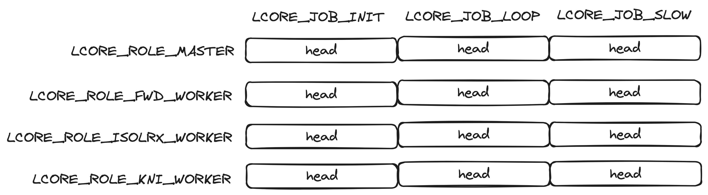
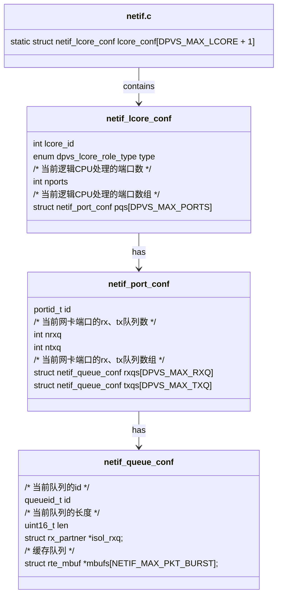

# 开篇词
这篇文章作为这个项目开篇，可以带你学习如何理解一个开源项目，这也是我学习的第一个使用C语言的开源项目。总结下来，学习一个开源项目，首先要知道怎么把这个项目构建并运行起来，通过阅读官方文档是实现这一目标的最佳实践。这里的README.md和tutorial.md是不错的选择。所以阅读本文的前提是你起码阅读了大概的官方文档，知道相关的术语。

## 一切的开端
从官方文档我们可以看出，这个项目基于makefile构建，从项目根目录中的makefile我们可以看到，生成可执行程序的代码来源于两个目录：src和tools。其中src生成的可执行程序是dpvs，tools生成的可执行程序是dpip、ipvsadm、keepalived。其中dpvs就是实现负载均衡的核心了，其他的都是一些配置工具配合dpvs使用。在src中，我们找到main函数，他在main.c中。main函数是程序的入口，找到他等于是找到了突破口。
```C
<!-- main.c -->
int main(int argc, char *argv[])
{
    ...
    /* start slave worker threads */
    dpvs_lcore_start(0);

    ...

    /* start control plane thread loop */
    dpvs_lcore_start(1);

    ...
}
```
## 寻找驱动力
这里我们暂时忽略其他代码，围绕本文的主题来抓，在main方法中调用了一个核心方法：`dpvs_lcore_start`，他就是驱动dpvs运行的核心了，这里面会有while循环不断的驱动着DPDK进行着收发包。从注释看，方法调用了两次，对应了启动了不同线程，第一次调用是启动了worker线程，第二次调用是启动了控制平面线程，也叫master。这种模式类似于Nginx的线程模型。那么现在我们进入`dpvs_lcore_start`方法，这里面有如下代码：
```C
<!-- scheduler.c -->
int dpvs_lcore_start(int is_master)
{
    if (is_master)
        return dpvs_job_loop(NULL);
    return rte_eal_mp_remote_launch(dpvs_job_loop, NULL, SKIP_MAIN);
}
```
要明白这段代码的含义，首先要知道`rte_eal_mp_remote_launch`，他是DPDK提供的用于在每个CPU运行指定函数的。所以无论是master还是woker，他们都是不约而同的调用了`dpvs_job_loop`方法，区别就是master只会有单个线程运行`dpvs_job_loop`，而woker是多个线程同时运行`dpvs_job_loop`。所以接下的分析就来到了`dpvs_job_loop`方法了。
```C
<!-- scheduler.c -->
static int dpvs_job_loop(void *arg)
{
    ...

    /* do init job */
    list_for_each_entry(job, &dpvs_lcore_jobs[role][LCORE_JOB_INIT], list) {
        do_lcore_job(job);
    }

    while (1) {

        ++this_poll_tick;
        netif_update_worker_loop_cnt();

        /* do normal job */
        list_for_each_entry(job, &dpvs_lcore_jobs[role][LCORE_JOB_LOOP], list) {
            do_lcore_job(job);
        }

        /* do slow job */
        list_for_each_entry(job, &dpvs_lcore_jobs[role][LCORE_JOB_SLOW], list) {
            if (this_poll_tick % job->skip_loops == 0) {
                do_lcore_job(job);
            }
        }

        ...
    }

    return EDPVS_OK;
}
```
看！我们揪出核心的while循环了，在执行循环前做了一些初始化的工作，然后就开始循环的做一些工作，这里似乎`do_lcore_job`很关键，点进去看看他的代码
```C
<!-- scheduler.c -->
static inline void do_lcore_job(struct dpvs_lcore_job *job)
    job->func(job->data);
}
```
里面似乎没有什么深奥的，就行执行了dpvs_lcore_job的函数指针。所以回到上面，我们发现`dpvs_lcore_jobs`这个二维数组才是关键，他维护了worker和master线程需要执行的任务。

## 龙虎任务榜
首先我们找到这个二维数组的定义
```C
<!-- scheduler.c -->
// scheduler.h
/* Note: lockless, lcore_job can only be register on initialization stage and
 *       unregistered on cleanup stage.
    job的注册：dpvs_lcore_job_register
 */
static struct list_head dpvs_lcore_jobs[LCORE_ROLE_MAX][LCORE_JOB_TYPE_MAX];
```
可以看到这个数组是以core角色和任务类型为维度的。这个数组的值来自函数`dpvs_lcore_job_register`，调用这个函数可以往数组添加任务。
```C
/*
注册job任务
1. 通过SIGHUP信号重新加载配置:
    &reload_job, LCORE_ROLE_MASTER, LCORE_JOB_LOOP
2. 处理master core的msg_ring信息的:
    &msg_master_job, LCORE_ROLE_MASTER, LCORE_JOB_LOOP
3. 处理除master core以外的msg_ring信息的:
    &msg_slave_job, LCORE_ROLE_FWD_WORKER
4. 统计每个网络接口的流量信息
    &iftraf_job, LCORE_ROLE_MASTER, LCORE_JOB_LOOP
5. 释放某种mbuf:
    &frag_job, LCORE_ROLE_FWD_WORKER, LCORE_JOB_SLOW
6.处理 neigh_ring :
    &neigh_jobs[i].job,neigh_jobs[i].role
7. 集合
    &netif_jobs[i].job, netif_jobs[i].role
8. 流量控制:
    &qsch_sched_job, LCORE_ROLE_FWD_WORKER
9. 监听控制面：dpvsadm、dpip、keepalived指令并进行设置:
    sockopt_job, LCORE_JOB_LOOP, LCORE_ROLE_MASTER
*/
int dpvs_lcore_job_register(struct dpvs_lcore_job *lcore_job, dpvs_lcore_role_t role)
{
    struct dpvs_lcore_job *cur;

    if (unlikely(NULL == lcore_job || role >= LCORE_ROLE_MAX))
        return EDPVS_INVAL;

    if (unlikely(LCORE_JOB_SLOW == lcore_job->type && lcore_job->skip_loops <= 0))
        return EDPVS_INVAL;

    list_for_each_entry(cur, &dpvs_lcore_jobs[role][lcore_job->type], list) {
        if (cur == lcore_job) {
            return EDPVS_EXIST;
        }
    }

    list_add_tail(&lcore_job->list, &dpvs_lcore_jobs[role][lcore_job->type]);

    return EDPVS_OK;
}
```
这个代码里面会进行参数的合法性校验，并且会检查任务是否重复添加，检查通过以后就会往数组里面添加任务。这个二维数组其实保存的是任务链表，添加任务就是往链表添加元素。

查询`dpvs_lcore_job_register`的调用，我们可以找到注册了哪些任务，这里我在代码注释已经标识好了。这其中跟本文主题强相关的任务是`netif_jobs`
```C
<!-- src/netif.c -->
static struct dpvs_lcore_job_array netif_jobs[NETIF_JOB_MAX] = {
    [0] = {
        .role = LCORE_ROLE_FWD_WORKER,
        .job.name = "recv_fwd",
        .job.type = LCORE_JOB_LOOP,
        .job.func = lcore_job_recv_fwd, // 负责从网口接受数据
    },

    [1] = {
        .role = LCORE_ROLE_FWD_WORKER,
        .job.name = "xmit",
        .job.type = LCORE_JOB_LOOP,
        .job.func = lcore_job_xmit, // 负责从网口发送数据
    },

    [2] = {
        .role = LCORE_ROLE_FWD_WORKER,
        .job.name = "timer_manage",
        .job.type = LCORE_JOB_LOOP,
        .job.func = lcore_job_timer_manage,
    },

    [3] = {
        .role = LCORE_ROLE_ISOLRX_WORKER,
        .job.name = "isol_pkt_rcv",
        .job.type = LCORE_JOB_LOOP,
        .job.func = recv_on_isol_lcore,
    },

    [4] = {
        .role = LCORE_ROLE_MASTER,
        .job.name = "timer_manage",
        .job.type = LCORE_JOB_LOOP,
        .job.func = lcore_job_timer_manage,
    },
};
```
dpvs负载均衡是围绕对网络的收发包来进行的，所以这里有两个很重要的任务recv_fwd和xmit，他们的func指针函数分别指向`lcore_job_recv_fwd`和`lcore_job_xmit`，他们分别负责从dpdk控制的网口收包和发包。
## 主线任务之接受数据包
我们首先查看是怎么接收数据的，因为他是一切的开端
```C
<!-- src/netif.c -->
static void lcore_job_recv_fwd(void *arg)
{
    int i, j;
    portid_t pid;
    lcoreid_t cid;
    struct netif_queue_conf *qconf;

    cid = rte_lcore_id();
    assert(LCORE_ID_ANY != cid);

    for (i = 0; i < lcore_conf[lcore2index[cid]].nports; i++) {
        // 遍历当前lcore的nic端口
        pid = lcore_conf[lcore2index[cid]].pqs[i].id;
        assert(pid <= bond_pid_end);

        for (j = 0; j < lcore_conf[lcore2index[cid]].pqs[i].nrxq; j++) {
            // 遍历当前nic端口对应的rx队列
            qconf = &lcore_conf[lcore2index[cid]].pqs[i].rxqs[j];
            // 提前处理 arp_ring 队列
            lcore_process_arp_ring(cid);
            // 提前处理 dp_vs_redirect_ring 队列
            lcore_process_redirect_ring(cid);
            // 从nic的rx队列中取出数据包
            qconf->len = netif_rx_burst(pid, qconf);
            // 记录lcore的收包统计信息
            lcore_stats_burst(&lcore_stats[cid], qconf->len);
            // 处理每个接受队列里的数据包
            lcore_process_packets(qconf->mbufs, cid, qconf->len, 0);
        }
    }
}
```
每个函数所起到的作用，在注释里面都标注了，其中数组lcore_conf在后面会经常用到，可以看下他是怎么样初始化的，他里边记录这每个lcore（逻辑CPU）所对应哪几个网口，每个网口又对应那些个rx队列和tx队列，每个队列里面维护了一个mbuf队列，用于缓存待发送的数据包和待接收的数据包。

这里我们关注方法`netif_rx_burst`的调用，他是调用dpdk的`rte_eth_rx_burst`，这个可以说是dpvs和dpdk的关键结合点了，通过这个方法将数据从网卡接收到dpvs的缓存队列中去：通过网卡id和队列id，将数据放进mbufs，至此我们完成了数据的接受，那么接下来就是处理这些数据包了。
```C
<!-- src/netif.c -->
static inline uint16_t netif_rx_burst(portid_t pid, struct netif_queue_conf *qconf)
{
    struct rte_mbuf *mbuf;
    int nrx = 0;

    if (qconf->isol_rxq) {
        ...
    } else {
        // 将读取的数据放到缓存队列中
        nrx = rte_eth_rx_burst(pid, qconf->id, qconf->mbufs, NETIF_MAX_PKT_BURST);
    }

    qconf->len = nrx;
    return nrx;
}
```