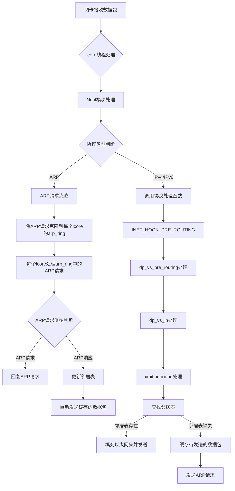

# 开篇词
在上一篇文章中，我们知道了DPVS是怎么跑起来的，知道了他在哪里接受数据并将数据放到了哪个位置，那么这篇文章就继续介绍DPVS在接受了数据以后是怎么处理并发送给后端realService的。不必苛求看懂每行代码，只要知道这个流程是怎么串起来的就行，只要知道了主流程，那么其他细枝末节就能通过主流程推导出来



## 书接上回
我们在`lcore_stats_burst`方法将网卡收到的数据保存到`qconf->mbufs`变量中，然后通过`lcore_process_packets`方法将这些数据包进行处理
```C
<!-- dpvs/src/netif.c -->
static void lcore_job_recv_fwd(void *arg)
{
    int i, j;
    portid_t pid;
    lcoreid_t cid;
    struct netif_queue_conf *qconf;

    cid = rte_lcore_id();
    assert(LCORE_ID_ANY != cid);

    for (i = 0; i < lcore_conf[lcore2index[cid]].nports; i++) {
        // 遍历当前lcore的nic端口
        pid = lcore_conf[lcore2index[cid]].pqs[i].id;
        assert(pid <= bond_pid_end);

        for (j = 0; j < lcore_conf[lcore2index[cid]].pqs[i].nrxq; j++) {
            // 遍历当前nic端口对应的rx队列
            qconf = &lcore_conf[lcore2index[cid]].pqs[i].rxqs[j];
            // 提前处理 arp_ring 队列，用于处理arp请求形成邻居表
            lcore_process_arp_ring(cid);
            // 提前处理 dp_vs_redirect_ring 队列
            lcore_process_redirect_ring(cid);
            // 从nic的rx队列中取出数据包
            qconf->len = netif_rx_burst(pid, qconf);
            // 记录lcore的收包统计信息
            lcore_stats_burst(&lcore_stats[cid], qconf->len);
            // 处理每个接受队列里的数据包
            lcore_process_packets(qconf->mbufs, cid, qconf->len, 0);
        }
    }
}
```
## 深入虎穴
接下来我们进入`lcore_process_packets`方法，这里会将数据包通过方法`rte_prefetch0`提前缓存到CPU cache中，以加速数据包的处理，可以看到这里的主要逻辑是把mbuf数组分割成单个mbuf逐个处理，每个mbuf通过`netif_deliver_mbuf`处理
```C
<!-- dpvs/src/netif.c -->
void lcore_process_packets(struct rte_mbuf **mbufs, lcoreid_t cid, uint16_t count, bool pkts_from_ring)
{
    int i, t;

    /* prefetch packets */
    for (t = 0; t < count && t < NETIF_PKT_PREFETCH_OFFSET; t++)
        rte_prefetch0(rte_pktmbuf_mtod(mbufs[t], void *));

    /* L2 filter */
    for (i = 0; i < count; i++) {
        struct rte_mbuf *mbuf = mbufs[i];
        struct netif_port *dev = netif_port_get(mbuf->port);

        if (unlikely(!dev)) {
            rte_pktmbuf_free(mbuf);
            lcore_stats[cid].dropped++;
            continue;
        }
        // bonding聚合类型的端口，实际处理对应的设备是master
        if (dev->type == PORT_TYPE_BOND_SLAVE) {
            dev = dev->bond->slave.master;
            mbuf->port = dev->id;
        }

        mbuf->tx_offload = 0; /* reset l2_len, l3_len, l4_len, ... */

        if (t < count) {
            rte_prefetch0(rte_pktmbuf_mtod(mbufs[t], void *));
            t++;
        }

        /* handler should free mbuf 分割单个mbuf并进行处理 */
        netif_deliver_mbuf(dev, cid, mbuf, pkts_from_ring);
    }
}
```
接下来我们查看`netif_deliver_mbuf`方法，这里也是一些细枝末节的处理，例如kni、traffic control，这里我们暂时跳过这些细小的分支，继续深入方法`netif_rcv_mbuf`源码
```C
<!-- dpvs/src/netif.c -->
/**
pkts_from_ring：指明mbuf是否来自ring，有可能是来自前面的 dp_vs_redirect_ring arp_ring
 */
static int netif_deliver_mbuf(struct netif_port *dev, lcoreid_t cid,
                  struct rte_mbuf *mbuf, bool pkts_from_ring)
{
    int ret = EDPVS_OK;
    struct rte_ether_hdr *eth_hdr;

    assert(mbuf->port <= NETIF_MAX_PORTS);
    assert(dev != NULL);

    eth_hdr = rte_pktmbuf_mtod(mbuf, struct rte_ether_hdr *);
    /* reuse mbuf.packet_type, it was RTE_PTYPE_XXX */
    mbuf->packet_type = eth_type_parse(eth_hdr, dev);

    /*
     * In NETIF_PORT_FLAG_FORWARD2KNI mode.
     * All packets received are deep copied and sent to KNI
     * for the purpose of capturing forwarding packets.Since the
     * rte_mbuf will be modified in the following procedure,
     * we should use mbuf_copy instead of rte_pktmbuf_clone.
     */
    if (dev->flag & NETIF_PORT_FLAG_FORWARD2KNI) {
        struct rte_mbuf *mbuf_copied = mbuf_copy(mbuf, pktmbuf_pool[dev->socket]);
        if (likely(mbuf_copied != NULL))
            kni_ingress(mbuf_copied, dev);
        else
            RTE_LOG(WARNING, NETIF, "%s: failed to copy mbuf for kni\n", __func__);
    }

    if (!pkts_from_ring && (dev->flag & NETIF_PORT_FLAG_TC_INGRESS)) {
        // 处理入站方向的traffic control
        mbuf = tc_hook(netif_tc(dev), mbuf, TC_HOOK_INGRESS, &ret);
        if (!mbuf)
            return ret;
    }

    return netif_rcv_mbuf(dev, cid, mbuf, pkts_from_ring);
}
```
## 道路的抉择
这个方法的逻辑略显的多，简单来说，这里包含了处理vlan、arp应答包的逻辑，这些不详细展开讲，关键在于方法`pt->func(mbuf, dev)`的调用，pt是`pkt_type_get()`根据`eth_hdr->ether_type`筛选得到的协议处理函数，这里根据不同的协议有以下函数实现：`ipv4_rcv、ip6_rcv、neigh_resolve_input`，他们分别是处理ipv4协议、ipv6协议、arp协议，这里我们假设处理的是ipv4协议，那么我们继续深入`ipv4_rcv`
```c
<!-- dpvs/src/netif.c -->
int netif_rcv_mbuf(struct netif_port *dev, lcoreid_t cid, struct rte_mbuf *mbuf, bool pkts_from_ring)
{
    struct rte_ether_hdr *eth_hdr;
    struct pkt_type *pt;
    int err;
    uint16_t data_off;
    bool forward2kni;

    eth_hdr = rte_pktmbuf_mtod(mbuf, struct rte_ether_hdr *);
    /*
     * handle VLAN
     * if HW offload vlan strip, it's still need vlan module
     * to act as VLAN filter.
     */
    if (eth_hdr->ether_type == htons(ETH_P_8021Q) ||
            mbuf->ol_flags & PKT_RX_VLAN_STRIPPED) {
        ...
    }

    ...

    pt = pkt_type_get(eth_hdr->ether_type, dev);

    /* clone arp pkt to every queue */
    if (unlikely(pt->type == rte_cpu_to_be_16(RTE_ETHER_TYPE_ARP) && !pkts_from_ring)) {
        ...
    }

    mbuf->l2_len = sizeof(struct rte_ether_hdr);

    /* Remove ether_hdr at the beginning of an mbuf */
    data_off = mbuf->data_off;
    if (unlikely(NULL == rte_pktmbuf_adj(mbuf, sizeof(struct rte_ether_hdr))))
        goto drop;

    /* 
    针对不同的ether_type（0x0800：IPv4、0x0806：ARP、0x86DD：IPv6）调用不同的处理函数
    ipv4处理: &ip4_pkt_type.func = ipv4_rcv
    ipv6处理: &ip6_pkt_type.func = ip6_rcv
    arp协议包处理: &arp_pkt_type.func = neigh_resolve_input
    */
    err = pt->func(mbuf, dev);

    ...
}
```
`ipv4_rcv`这个方法需要关注的不多，主要是一些参数的校验，我们直接快进到最后一行函数的调用`INET_HOOK`，这个函数的最后一个参数`ipv4_rcv_fin`不要忽略掉，当`INET_HOOK`走到最后会调用这个函数，`INET_HOOK`这个函数借鉴了Linux的网络栈，方便对应用进行扩展
```c
<!-- dpvs/src/ipv4.c -->
static int ipv4_rcv(struct rte_mbuf *mbuf, struct netif_port *port)
{
    ...


    return INET_HOOK(AF_INET, INET_HOOK_PRE_ROUTING,
                     mbuf, port, NULL, ipv4_rcv_fin);
```
由于前面对`INET_HOOK`调用使用的参数是：AF_INET, INET_HOOK_PRE_ROUTING，所以下面的hook_list会有这两个实现并依次调用：dp_vs_pre_routing、dp_vs_in。下面看看这两个函数的实现，看看他们里面有什么需要我们关注的，我们先看`dp_vs_pre_routing`
```c
<!-- dpvs/src/inet.c -->
int INET_HOOK(int af, unsigned int hook, struct rte_mbuf *mbuf,
              struct netif_port *in, struct netif_port *out,
              int (*okfn)(struct rte_mbuf *mbuf))
{
    struct list_head *hook_list;
    struct inet_hook_ops *ops;
    struct inet_hook_state state;
    int verdict = INET_ACCEPT; // INET_ACCEPT表示mbuf符合要求已被处理

    state.hook = hook;
    // 根据hook获取拓展函数，用于自定义场景拓展，系统自带的hook只有: INET_HOOK_PRE_ROUTING ，定义在: dp_vs_ops
    hook_list = af_inet_hooks(af, hook);

    ops = list_entry(hook_list, struct inet_hook_ops, list);

    if (!list_empty(hook_list)) {
        verdict = INET_ACCEPT;
        list_for_each_entry_continue(ops, hook_list, list) {
repeat:
            /*
            ops的值有: dp_vs_ops （有此仅有一个）
             1.对于ipv4协议即af=AF_INET、路由转发前：hook=INET_HOOK_PRE_ROUTING 来说
               ops->hook()有两个实现方法，循环会依次调用 -> dp_vs_pre_routing  dp_vs_in
             2.对于ipv6协议即af=AF_INET6、路由转发前：hook=INET_HOOK_PRE_ROUTING 来说
               ops->hook()有两个实现方法，循环会依次调用 -> dp_vs_pre_routing6  dp_vs_in6
            */
            verdict = ops->hook(ops->priv, mbuf, &state);
            if (verdict != INET_ACCEPT) {
                if (verdict == INET_REPEAT)
                    goto repeat;
                break;
            }
        }
    }

    // 对于没有定义hook的场景，直接调用okfn
    if (verdict == INET_ACCEPT || verdict == INET_STOP) {
        return okfn(mbuf);
    } else if (verdict == INET_DROP) {
        rte_pktmbuf_free(mbuf);
        return EDPVS_DROP;
    } else { /* INET_STOLEN */
        return EDPVS_OK;
    }
}
```
`__dp_vs_pre_routing`中的作用大概是IP分片和synProxy的处理，这里不再展开，下一个关键函数的调用是`__dp_vs_in`
```c
<!-- dpvs/src/ipvs/ip_vs_core.c -->
static int __dp_vs_pre_routing(void *priv, struct rte_mbuf *mbuf,
                    const struct inet_hook_state *state, int af)
{
    struct dp_vs_iphdr iph;
    struct dp_vs_service *svc;

    // 将mbuf中ip协议的相关信息填充到iph中
    if (EDPVS_OK != dp_vs_fill_iphdr(af, mbuf, &iph))
        return INET_ACCEPT;

    /* Drop all ip fragment except ospf 
    当数据长度超过网络设备的MTU时，一般会发生分片
    这里丢弃的原因可能是：
        1. IP分片重组复杂且容易被利用进行攻击（如分片攻击）
        2. 简化处理流程，提高安全性与效率
    在 __dp_vs_in 找到一份为什么不处理分片的官方回答
    */
    if ((af == AF_INET) && ip4_is_frag(ip4_hdr(mbuf))) {
        dp_vs_estats_inc(DEFENCE_IP_FRAG_DROP);
        return INET_DROP;
    }

    /* Drop udp packet which send to tcp-vip */
    if (g_defence_udp_drop && IPPROTO_UDP == iph.proto) {
        if ((svc = dp_vs_vip_lookup(af, IPPROTO_UDP, &iph.daddr, rte_lcore_id())) == NULL) {
            if ((svc = dp_vs_vip_lookup(af, IPPROTO_TCP, &iph.daddr, rte_lcore_id())) != NULL) {
                dp_vs_estats_inc(DEFENCE_UDP_DROP);
                return INET_DROP;
            }
        }
    }

    /* Synproxy: defence synflood + 黑白名单过滤 +  判断dp_vs_service.weight */
    if (IPPROTO_TCP == iph.proto) {
        int v = INET_ACCEPT;
        // 不需要synproxy返回1
        if (0 == dp_vs_synproxy_syn_rcv(af, mbuf, &iph, &v))
            return v;
    }

    return INET_ACCEPT;
}
```
## 危机初显
这里出现了几个重要的概念：dp_vs_conn、in/outbound，理解这两个概念对你理解dpvs的实现会有帮助，下面这张图是根据官方文档描述的Simple Full-NAT (two-arm)架构图描述了上述概念。这个架构图描述了inbound、outbound究竟代表哪个方向，以及客户端发往后端服务的数据包中的IP和端口是怎么变化的


这个函数的主要功能有：处理IP分片、查找dp_vs_conn、并按照conn记录的in/outbound方向将数据发送出去。如果是一个新的连接，那么就要根据**调度模式**和**转发模式**来构建一个新的dp_vs_conn，这里说的**调度模式**和**转发模式**我们先研究常用的：轮训（rr）+ fallNat

假设我们现在是从client客户端向服务端发送了一个ipv4的tcp握手请求，那么根据前面的in/outbound示意图，此时他的dir方向是inbound的，那么下一步要执行的方法是`xmit_inbound(mbuf, prot, conn)`

```c
<!-- dpvs/src/ipvs/ip_vs_core.c -->
static int __dp_vs_in(void *priv, struct rte_mbuf *mbuf,
                      const struct inet_hook_state *state, int af)
{
    struct dp_vs_iphdr iph;
    struct dp_vs_proto *prot;
    struct dp_vs_conn *conn;
    /** 
    dir表示方向，参考常规的互联网架构，
    - DPVS_CONN_DIR_INBOUND表示客户端发往服务端的请求
    - DPVS_CONN_DIR_OUTBOUND表示服务端对客户端的响应
    */
    int dir, verdict, err, related;
    bool drop = false;
    lcoreid_t cid, peer_cid;
    eth_type_t etype = mbuf->packet_type; /* FIXME: use other field ? */
    assert(mbuf && state);

    cid = peer_cid = rte_lcore_id();

    if (unlikely(etype != ETH_PKT_HOST))
        return INET_ACCEPT;
    // 将mbuf中ip协议的相关信息填充到iph中
    if (dp_vs_fill_iphdr(af, mbuf, &iph) != EDPVS_OK)
        return INET_ACCEPT;

    if (unlikely(iph.proto == IPPROTO_ICMP ||
                 iph.proto == IPPROTO_ICMPV6)) {
        /* handle related ICMP error to existing conn */
        verdict = dp_vs_in_icmp(af, mbuf, &related);
        if (related || verdict != INET_ACCEPT)
            return verdict;
        /* let unrelated and valid ICMP goes down,
         * may implement ICMP fwd in the futher. */
    }

    /*
    l4协议处理函数：
    &dp_vs_proto_udp
    &dp_vs_proto_tcp
    &dp_vs_proto_icmp6
    &dp_vs_proto_icmp
    */
    prot = dp_vs_proto_lookup(iph.proto);
    if (unlikely(!prot))
        return INET_ACCEPT;

    /*
    IP分片是将TCP/UDP分片数据包分成多个数据包，然后通过IP头中的标识符（fragment id）将这些数据包重新组合成一个完整的数据包。
    所以除了第一个IP分片以外，剩下的是不包含TCP/UDP头的，也就是说拿不到端口信息构成完整的五元组，这样就拿不到 dp_vs_conn
    RSS/flow-director是一种网络技术，能通过IP和端口信息来将数据包分配到对应的CPU核上，从而实现负载均衡。
     * Defrag ipvs-forwarding TCP/UDP is not supported for some reasons,
     * 
     * - RSS/flow-director do not support TCP/UDP fragments, means it's
     *   not able to direct frags to same lcore as original TCP/UDP packets.
     * - per-lcore conn table will miss if frags reachs wrong lcore.
     *
     * If we redirect frags to "correct" lcore, it may cause performance
     * issue. Also it need to understand RSS algorithm. Moreover, for the
     * case frags in same flow are not occur in same lcore, a global lock is
     * needed, which is not a good idea.
     */
    if (af == AF_INET && ip4_is_frag(ip4_hdr(mbuf))) {
        RTE_LOG(DEBUG, IPVS, "%s: frag not support.\n", __func__);
        return INET_DROP;
    }

    /* packet belongs to existing connection ? 
    1 dp_vs_proto_tcp.conn_lookup = tcp_conn_lookup
    */
    conn = prot->conn_lookup(prot, &iph, mbuf, &dir, false, &drop, &peer_cid);

    if (unlikely(drop)) {
        // conn_lookup通过黑白名单赋值drop
        RTE_LOG(DEBUG, IPVS, "%s: deny ip try to visit.\n", __func__);
        return INET_DROP;
    }

    /*
     * The connection is not locally found, however the redirect is found so
     * forward the packet to the remote redirect owner core.、
     cid != peer_cid表明peer_cid是在conn_lookup被修改的，而且conn的值为null
     */
    if (cid != peer_cid) {
        /* recover mbuf.data_off to outer Ether header */
        rte_pktmbuf_prepend(mbuf, (uint16_t)sizeof(struct rte_ether_hdr));

        return dp_vs_redirect_pkt(mbuf, peer_cid);
    }

    if (unlikely(!conn)) {
        /* try schedule RS and create new connection 
        1. dp_vs_proto_tcp.conn_sched = tcp_conn_sched
        */
        if (prot->conn_sched(prot, &iph, mbuf, &conn, &verdict) != EDPVS_OK) {
            /* RTE_LOG(DEBUG, IPVS, "%s: fail to schedule.\n", __func__); */
            return verdict;
        }

        /* only SNAT triggers connection by inside-outside traffic. */
        if (conn->dest->fwdmode == DPVS_FWD_MODE_SNAT)
            dir = DPVS_CONN_DIR_OUTBOUND;
        else
            dir = DPVS_CONN_DIR_INBOUND;
    } else {
        /*
        dp_vs_proto_tcp.conn_expire_quiescent = tcp_conn_expire_quiescent
        */
        /* assert(conn->dest != NULL); */
        if (prot->conn_expire_quiescent && (conn->flags & DPVS_CONN_F_EXPIRE_QUIESCENT) &&
                conn->dest && (!dp_vs_dest_is_avail(conn->dest) ||
                    rte_atomic16_read(&conn->dest->weight) == 0)) {
            RTE_LOG(INFO, IPVS, "%s: the conn is quiescent, expire it right now,"
                    " and drop the packet!\n", __func__);
            prot->conn_expire_quiescent(conn);
            dp_vs_conn_put(conn);
            return INET_DROP;
        }
    }

    if (conn->flags & DPVS_CONN_F_SYNPROXY) {
        if (dir == DPVS_CONN_DIR_INBOUND) {
            /* Filter out-in ack packet when cp is at SYN_SENT state.
             * Drop it if not a valid packet, store it otherwise */
            if (0 == dp_vs_synproxy_filter_ack(mbuf, conn, prot,
                                               &iph, &verdict)) {
                dp_vs_stats_in(conn, mbuf);
                dp_vs_conn_put(conn);
                return verdict;
            }

            /* "Reuse" synproxy sessions.
             * "Reuse" means update syn_proxy_seq struct
             * and clean ack_mbuf etc. */
            if (0 != dp_vs_synproxy_ctrl_conn_reuse) {
                if (0 == dp_vs_synproxy_reuse_conn(af, mbuf, conn, prot,
                                                   &iph, &verdict)) {
                    dp_vs_stats_in(conn, mbuf);
                    dp_vs_conn_put(conn);
                    return verdict;
                }
            }
        } else {
            /* Syn-proxy 3 logic: receive syn-ack from rs */
            if (dp_vs_synproxy_synack_rcv(mbuf, conn, prot,
                                          iph.len, &verdict) == 0) {
                dp_vs_stats_out(conn, mbuf);
                dp_vs_conn_put(conn);
                return verdict;
            }
        }
    }

    // 1. dp_vs_proto_tcp.state_trans = tcp_state_trans
    if (prot->state_trans) {
        // 维护conn->state状态机流转
        err = prot->state_trans(prot, conn, mbuf, dir);
        if (err != EDPVS_OK)
            RTE_LOG(WARNING, IPVS, "%s: fail to trans state.", __func__);
    }
    conn->old_state = conn->state;

    /* holding the conn, need a "put" later. */
    if (dir == DPVS_CONN_DIR_INBOUND)
        return xmit_inbound(mbuf, prot, conn);
    else
        return xmit_outbound(mbuf, prot, conn);
}
```

从注释看，这个函数做了一些conn参数的校验，最终调用`conn->packet_xmit`函数指针的方法发送数据包。当使用的是fullNat模式，`conn->packet_xmit`的实现方法为`dp_vs_xmit_fnat`。那么继续深入这个方法
```c
<!-- dpvs/src/ipvs/ip_vs_core.c -->
static int xmit_inbound(struct rte_mbuf *mbuf,
                        struct dp_vs_proto *prot,
                        struct dp_vs_conn *conn)
{
    int err;
    assert(mbuf && prot && conn);

    // inbound方向的流量统计
    if (dp_vs_stats_in(conn, mbuf)) {
        dp_vs_conn_put(conn);
        return INET_DROP;
    }

    /* is dest avaible to forward the packet ? */
    if (!conn->dest) {
        /* silently drop packet without reset connection timer.
         * wait for dest available or connection timeout. */
        dp_vs_conn_put_no_reset(conn);
        return INET_DROP;
    }

    if (!conn->packet_xmit) {
        RTE_LOG(WARNING, IPVS, "%s: missing packet_xmit\n", __func__);
        dp_vs_conn_put(conn);
        return INET_ACCEPT;
    }

    /* forward to RS 
    1.fullnat: dp_vs_xmit_fnat
    */
    err = conn->packet_xmit(prot, conn, mbuf);
    if (err != EDPVS_OK)
        RTE_LOG(DEBUG, IPVS, "%s: fail to transmit: %d\n", __func__, err);

    dp_vs_conn_put(conn);
    /* always stolen the packet */
    return INET_STOLEN;
}
```
这里会判断in/outbound方向的ip版本，因为有的服务对外提供的公网IP是是IPV6的，但是内网的真实服务器还是使用的IPV4，但是常规的还是无论公网还是内网都是使用IPV4，所以这里需要不同的场景做分别处理。假设我们这两个方向都使用的是ipv4，那么就会调用`__dp_vs_xmit_fnat4(proto, conn, mbuf)`，继续深入这个方法
```c
int dp_vs_xmit_fnat(struct dp_vs_proto *proto,
                    struct dp_vs_conn *conn,
                    struct rte_mbuf *mbuf)
{
    int af = conn->af;
    assert(af == AF_INET || af == AF_INET6);
    if (tuplehash_in(conn).af == AF_INET &&
        tuplehash_out(conn).af == AF_INET)
        return __dp_vs_xmit_fnat4(proto, conn, mbuf);
    if (tuplehash_in(conn).af == AF_INET6 &&
        tuplehash_out(conn).af == AF_INET6)
        return __dp_vs_xmit_fnat6(proto, conn, mbuf);
    if (tuplehash_in(conn).af == AF_INET6 &&
        tuplehash_out(conn).af == AF_INET)
        return __dp_vs_xmit_fnat64(proto, conn, mbuf);

    rte_pktmbuf_free(mbuf);
    return EDPVS_NOTSUPP;
}
```
由于我们现在是假设第一次tcp握手，那么不满足fast_xmit的条件，所以会继续往下执行，然后会根据目的IP寻找路由配置：`route4_output`，这个路由配置就是我们通过`dpip route add ...`添加的

然后会执行`proto->fnat_in_pre_handler`和`proto->fnat_in_handler`，对于tcp协议，`proto->fnat_in_pre_handler`是空的则跳过，`proto->fnat_in_handler`的实现是`tcp_fnat_in_handler`，我们进去这个方法瞅一眼，他主要是构建转发给realService的tcp头
```c
static int __dp_vs_xmit_fnat4(struct dp_vs_proto *proto,
                              struct dp_vs_conn *conn,
                              struct rte_mbuf *mbuf)
{
    struct flow4 fl4;
    struct rte_ipv4_hdr *iph = ip4_hdr(mbuf);
    struct route_entry *rt;
    int err, mtu;

    /**
     * fast_xmit机制的意思是，通过conn缓存的mac地址和dev，直接将数据包构建好放到对应的发送队列，而不用通过route和neighbour查找
     * 当然，如果是第一次接受到数据包，那么还是要通过route和neighbour查找mac和dev，但是后续的包直接通过fast_xmit机制就可以发送出去了
     */
    // 判断是否需要快速传输机制，默认开启快速传输，通过配置项：fast_xmit_close（dpvs/conf/dpvs.conf.items）
    if (!fast_xmit_close && !(conn->flags & DPVS_CONN_F_NOFASTXMIT)) {
        // 在conn记录outbound相关的mac和dev
        dp_vs_save_xmit_info(mbuf, proto, conn);
        // 当tcp/udp的第一个包走到这里的时候，会因为conn中的这些属性（in_dev、in_dmac、in_smac）没有值而返回EDPVS_NOROUTE，进而 跳过fast_xmit
        if (!dp_vs_fast_xmit_fnat(AF_INET, proto, conn, mbuf)) {
            // 返回EDPVS_OK说明fast_xmit快速传输成功，不再需要需要下面的路由信息处理
            return EDPVS_OK;
        }
    }

    /*
     * drop old route. just for safe, because
     * FNAT is PRE_ROUTING, should not have route.
     */
    if (unlikely(MBUF_USERDATA(mbuf, struct route_entry *, MBUF_FIELD_ROUTE) != NULL)) {
        RTE_LOG(WARNING, IPVS, "%s: FNAT have route %p ?\n", __func__,
                MBUF_USERDATA(mbuf, struct route_entry *, MBUF_FIELD_ROUTE));
        route4_put(MBUF_USERDATA(mbuf, struct route_entry *, MBUF_FIELD_ROUTE));
    }

    memset(&fl4, 0, sizeof(struct flow4));
    fl4.fl4_daddr = conn->daddr.in;
    fl4.fl4_saddr = conn->laddr.in;
    fl4.fl4_tos = iph->type_of_service;
    // 根据目的IP寻找路由配置
    rt = route4_output(&fl4);
    if (!rt) {
        err = EDPVS_NOROUTE;
        goto errout;
    }

    /*
     * didn't cache the pointer to rt
     * or route can't be deleted when there is conn ref
     * this is for neighbour confirm
     * 将路由rt的信息保存在conn->in_dev、in_nexthop
     */
    dp_vs_conn_cache_rt(conn, rt, true);

    mtu = rt->mtu;
    if (mbuf->pkt_len > mtu
            && (iph->fragment_offset & htons(RTE_IPV4_HDR_DF_FLAG))) {
        RTE_LOG(DEBUG, IPVS, "%s: frag needed.\n", __func__);
        icmp_send(mbuf, ICMP_DEST_UNREACH, ICMP_UNREACH_NEEDFRAG, htonl(mtu));
        err = EDPVS_FRAG;
        goto errout;
    }

    // 将路由信息缓存到mbuf的自定义字段中，方便后续处理
    MBUF_USERDATA(mbuf, struct route_entry *, MBUF_FIELD_ROUTE) = rt;

    /* after route lookup and before translation */
    if (xmit_ttl) {
        if (unlikely(iph->time_to_live <= 1)) {
            icmp_send(mbuf, ICMP_TIME_EXCEEDED, ICMP_EXC_TTL, 0);
            err = EDPVS_DROP;
            goto errout;
        }

        iph->time_to_live--;
    }

    /* pre-handler before translation 
    dp_vs_proto_tcp.fnat_in_pre_handler = null
    dp_vs_proto_udp.fnat_in_pre_handler = udp_fnat_in_pre_handler
    */
    if (proto->fnat_in_pre_handler) {
        err = proto->fnat_in_pre_handler(proto, conn, mbuf);
        if (err != EDPVS_OK)
            goto errout;

        /*
         * re-fetch IP header
         * the offset may changed during pre-handler
         */
        iph = ip4_hdr(mbuf);
    }

    /* L3 translation before l4 re-csum */
    iph->hdr_checksum = 0;
    iph->src_addr = conn->laddr.in.s_addr;
    iph->dst_addr = conn->daddr.in.s_addr;

    /* L4 FNAT translation */
    /*
    1. dp_vs_proto_tcp.fnat_in_handler = tcp_fnat_in_handler : 构建新的tcp头
    2. dp_vs_proto_udp.fnat_in_handler = udp_fnat_in_handler
     */
    if (proto->fnat_in_handler) {
        err = proto->fnat_in_handler(proto, conn, mbuf);
        if (err != EDPVS_OK)
            goto errout;
        iph = ip4_hdr(mbuf);
    }

    if (likely(mbuf->ol_flags & PKT_TX_IP_CKSUM)) {
        iph->hdr_checksum = 0;
    } else {
        ip4_send_csum(iph);
    }

    // ip头、tcp/udp头处理好了，现在要处理以太网头。由于这里没有配置hook:INET_HOOK_LOCAL_OUT，所以进入ipv4_output函数
    return INET_HOOK(AF_INET, INET_HOOK_LOCAL_OUT, mbuf,
                     NULL, rt->port, ipv4_output);

errout:
    if (rt)
        route4_put(rt);
    rte_pktmbuf_free(mbuf);
    return err;
}
```

这里做了toa/proxy_protocol的处理，就是将原始IP传递给realService，具体使用方法官方文档中有说明。然后就是将新的端口号（包括源端口、目的端口）赋值给数据包，还有就是设置新的tcp序列号seq和校验和check_sum，执行完这个方法，那么tcp头就构建好了，然后我们再返回上一个方法`__dp_vs_xmit_fnat4`
```c
static int tcp_fnat_in_handler(struct dp_vs_proto *proto,
                        struct dp_vs_conn *conn, struct rte_mbuf *mbuf)
{
    struct tcphdr *th;
    int af;             /* outbound af */
    int iphdrlen, toalen;
    int err, pp_hdr_shift = 0;

    af = tuplehash_out(conn).af;
    iphdrlen = ((AF_INET6 == af) ? ip6_hdrlen(mbuf): ip4_hdrlen(mbuf));

    if (mbuf_may_pull(mbuf, iphdrlen + sizeof(*th)) != 0)
        return EDPVS_INVPKT;

    th = tcp_hdr(mbuf);
    if (unlikely(!th))
        return EDPVS_INVPKT;

    if (mbuf_may_pull(mbuf, iphdrlen + (th->doff << 2)) != 0)
        return EDPVS_INVPKT;

    /*
     * for SYN packet
     * 1. remove tcp timestamp option,
     *    laddrs for different clients have diff timestamp.
     * 2. save original TCP sequence for seq-adjust later
     *    since TCP option will be changed.
     */
    if (th->syn && !th->ack) {
        tcp_in_remove_ts(th);
        tcp_in_init_seq(conn, mbuf, th);
    }

    /* Add toa/proxy_protocol to the first data packet */
    if (ntohl(th->ack_seq) == conn->fnat_seq.fdata_seq
            && !th->syn && !th->rst /*&& !th->fin*/) {
        if (PROXY_PROTOCOL_V2 == PROXY_PROTOCOL_VERSION(conn->pp_version)
                || PROXY_PROTOCOL_V1 == PROXY_PROTOCOL_VERSION(conn->pp_version)) {
            if (conn->fnat_seq.isn - conn->fnat_seq.delta + 1 == ntohl(th->seq)) {
                /* avoid inserting repetitive proxy protocol data
                 * when the first rs ack is delayed */
                err = tcp_in_add_proxy_proto(conn, mbuf, th, iphdrlen, &pp_hdr_shift);
                if (unlikely(EDPVS_OK != err))
                    RTE_LOG(INFO, IPVS, "%s: insert proxy protocol fail -- %s\n",
                            __func__, dpvs_strerror(err));
                th = ((void *)th) + pp_hdr_shift;
            }
        } else { /* use toa */
            err = tcp_in_add_toa(conn, mbuf, th);
            if (unlikely(EDPVS_OK != err)) {
                toalen = tuplehash_in(conn).af == AF_INET ? TCP_OLEN_IP4_ADDR : TCP_OLEN_IP6_ADDR;
                if (tcp_in_prune_options(af, toalen, mbuf, th) >= toalen
                        && (EDPVS_NOROOM == err || EDPVS_FRAG == err)) {
                    err = tcp_in_add_toa(conn, mbuf, th);
                }
                if (EDPVS_OK != err) {
                    char caddrbuf[64], vaddrbuf[64], laddrbuf[64], daddrbuf[64];
                    const char *caddr, *vaddr, *laddr, *daddr;
                    caddr = inet_ntop(conn->af, &conn->caddr, caddrbuf, sizeof(caddrbuf)) ? caddrbuf : "::";
                    vaddr = inet_ntop(conn->af, &conn->vaddr, vaddrbuf, sizeof(vaddrbuf)) ? vaddrbuf : "::";
                    laddr = inet_ntop(af, &conn->laddr, laddrbuf, sizeof(laddrbuf)) ? laddrbuf : "::";
                    daddr = inet_ntop(af, &conn->daddr, daddrbuf, sizeof(daddrbuf)) ? daddrbuf : "::";
                    RTE_LOG(WARNING, IPVS, "TOA add failed(%s): [%s]:%d -> [%s]:%d; [%s]:%d -> [%s]:%d\n",
                            dpvs_strerror(err), caddr, htons(conn->cport), vaddr, htons(conn->vport),
                            laddr, htons(conn->lport), daddr, htons(conn->dport));
                }
            }
        }
    }

    // 填充tcp序号seq
    tcp_in_adjust_seq(conn, th);

    /* L4 translation */
    th->source  = conn->lport;
    th->dest    = conn->dport;

    // 填充tcp校验和check
    return tcp_send_csum(af, iphdrlen, th, conn, mbuf, conn->in_dev);
}
```
回到`__dp_vs_xmit_fnat4`方法中，接下来应该执行的方法是`INET_HOOK(AF_INET, INET_HOOK_LOCAL_OUT, mbuf,NULL, rt->port, ipv4_output)`，这个函数是我们的老朋友了，由于这里没有配置`INET_HOOK_LOCAL_OUT`的hook，所以会在`INET_HOOK`函数的最后调用`ipv4_output`，那我们继续深入这个方法

这个方法主要做了iftraf的处理，照例出现了`INET_HOOK`，同样因为没有配置`INET_HOOK_POST_ROUTING`的hook，所以会调用`ipv4_output_fin`，继续深入这个方法

```c
int ipv4_output(struct rte_mbuf *mbuf)
{
    struct route_entry *rt = MBUF_USERDATA(mbuf, struct route_entry *, MBUF_FIELD_ROUTE);
    assert(rt);

    IP4_UPD_PO_STATS(out, mbuf->pkt_len);
    mbuf->port = rt->port->id;
    iftraf_pkt_out(AF_INET, mbuf, rt->port);

    return INET_HOOK(AF_INET, INET_HOOK_POST_ROUTING, mbuf,
            NULL, rt->port, ipv4_output_fin);
}
```
假如mbuf的数据大于路由配置的mtu，那么会将mbuf进行分片，然后调用`ipv4_fragment`，假设我们先简单的假设不需要分片，继续深入`ipv4_output_fin2`
```c
static int ipv4_output_fin(struct rte_mbuf *mbuf)
{
    struct route_entry *rt = MBUF_USERDATA(mbuf, struct route_entry *, MBUF_FIELD_ROUTE);

    if (mbuf->pkt_len > rt->mtu)
        return ipv4_fragment(mbuf, rt->mtu, ipv4_output_fin2);

    return ipv4_output_fin2(mbuf);
}
```
这里主要是判断下一跳的IP地址nexthop，并将他作为重要参数传递给`neigh_output`，这里nexthop的取数逻辑是：如果路由设置了网关地址，那么下一跳的IP地址就是网关地址，否则就是目的IP地址。
```c
static int ipv4_output_fin2(struct rte_mbuf *mbuf)
{
    struct route_entry *rt;
    int err;
    struct in_addr nexthop;

    rt = MBUF_USERDATA(mbuf, struct route_entry *, MBUF_FIELD_ROUTE);
    // 判断route是否配置了网关
    if (rt->gw.s_addr == htonl(INADDR_ANY))
        nexthop.s_addr = ip4_hdr(mbuf)->dst_addr; // 没有网关，下一跳地址直接设为目的地址
    else
        nexthop = rt->gw;

    /**
     * XXX:
     * because lacking of suitable fields in mbuf
     * (m.l3_type is only 4 bits, too short),
     * m.packet_type is used to save ether_type
     * e.g., 0x0800 for IPv4.
     * note it was used in RX path for eth_type_t.
     * really confusing.
     */
    mbuf->packet_type = RTE_ETHER_TYPE_IPV4;
    mbuf->l3_len = ip4_hdrlen(mbuf);

    err = neigh_output(AF_INET, (union inet_addr *)&nexthop, mbuf, rt->port);
    route4_put(rt);
    return err;
}
```
## 这就结束了吗
这里主要的任务就是通过下一跳地址nexthop找到对应的邻居表，这样才能拿到目的mac构建出以太网帧，然后调用`netif_xmit`发送出去。假如这里没有找到对应邻居表，那么就会添加一个新的邻居表项，并且发送arp请求看看谁有这个IP地址的mac地址，但是这个数据不能丢，需要缓存在`neighbour->queue_list`，这样在收到arp应答的时候，就能正确构建出以太网帧并发送出去。

假设我们现在是第一个tcp握手包，没有下一跳的mac信息，数据被缓存到neighbour->queue_list里面了，此时我们流程就结束了，DPVS所需要做的是，等待arp应答，然后继续发送。那么这个过程在哪里处理呢？我们思考一下，这个缓存包的发送的触发条件是arp应答，那么就是当网卡收到arp应答数据包时，所以我继续回到最开始的mbuf处理函数`netif_rcv_mbuf`
```c
int neigh_output(int af, union inet_addr *nexhop,
                 struct rte_mbuf *m, struct netif_port *port)
{
    struct neighbour_entry *neighbour;
    struct neighbour_mbuf_entry *m_buf;
    unsigned int hashkey;

    if (port->flag & NETIF_PORT_FLAG_NO_ARP)
        return netif_xmit(m, port);

    if (af == AF_INET6 && ipv6_addr_is_multicast((struct in6_addr *)nexhop)) {
        neigh_fill_mac(NULL, m, (struct in6_addr *)nexhop, port);
        return netif_xmit(m, port);
    }

#ifdef CONFIG_DPVS_NEIGH_DEBUG
    neigh_show_nexthop(__func__, af, nexhop, port);
#endif

    hashkey = neigh_hashkey(af, nexhop, port);
    neighbour = neigh_lookup_entry(af, nexhop, port, hashkey);

    if (neighbour) {
        switch (neighbour->state) {
        case DPVS_NUD_S_NONE:
        case DPVS_NUD_S_SEND:
            if (neighbour->que_num > arp_unres_qlen) {
                neigh_show_entry(__func__, neighbour);
                /*
                 * don't need arp request now,
                 * since neighbour will not be confirmed
                 * and it will be released late
                 */
                rte_pktmbuf_free(m);
                return EDPVS_DROP;
            }

            m_buf = dpvs_mempool_get(neigh_mempool, sizeof(struct neighbour_mbuf_entry));
            if (unlikely(!m_buf)) {
                rte_pktmbuf_free(m);
                return EDPVS_DROP;
            }

            m_buf->m = m;
            list_add_tail(&m_buf->neigh_mbuf_list, &neighbour->queue_list);
            neighbour->que_num++;

            if (neighbour->state == DPVS_NUD_S_NONE) {
                neigh_state_confirm(neighbour);
                neigh_entry_state_trans(neighbour, 0);
            }

            return EDPVS_OK;

        case DPVS_NUD_S_REACHABLE:
        case DPVS_NUD_S_PROBE:
        case DPVS_NUD_S_DELAY:
            // 填充mac地址
            neigh_fill_mac(neighbour, m, NULL, port);
            // 发送数据
            netif_xmit(m, neighbour->port);

            if (neighbour->state == DPVS_NUD_S_PROBE) {
                neigh_state_confirm(neighbour);
                neigh_entry_state_trans(neighbour, 0);
            }

            return EDPVS_OK;

        default:
            return EDPVS_IDLE;
        }
    }

    /* create the neighbour entry if not found */
    neighbour = neigh_add_table(af, nexhop, NULL, port, hashkey, 0);
    if (!neighbour) {
        RTE_LOG(ERR, NEIGHBOUR, "%s: add neighbour wrong\n", __func__);
        rte_pktmbuf_free(m);
        return EDPVS_NOMEM;
    }

    m_buf = dpvs_mempool_get(neigh_mempool, sizeof(struct neighbour_mbuf_entry));
    if (unlikely(!m_buf)) {
        rte_pktmbuf_free(m);
        return EDPVS_DROP;
    }
    m_buf->m = m; // 缓存待发送的mbuf，在获取neighbour成功后才会调用 neigh_send_mbuf_cach 发送
    list_add_tail(&m_buf->neigh_mbuf_list, &neighbour->queue_list);
    neighbour->que_num++;

    if (neighbour->state == DPVS_NUD_S_NONE) {
        // 对于初始状态的neighbour，发送arp探测mac并流转neighbour状态
        neigh_state_confirm(neighbour);
        neigh_entry_state_trans(neighbour, 0);
    }

    return EDPVS_OK;
}
```
## 峰回路转
在这里我们可以看到，此时`eth_hdr->ether_type`是arp协议`RTE_ETHER_TYPE_ARP`，他会将mbuf克隆一份，放进数组`arp_ring`，然后每个lcore都会通过这个数组构建自己的邻居表，使得邻居表可以具有pre_lcore和lockless的特点。
我们继续往下看，来到了`pt->func(mbuf, dev)`，此时pt指向的是`arp_pkt_type`，那么他的func函数指向的就是`neigh_resolve_input`，答案就在这里面，我们进去瞅瞅
```c
<!-- dpvs/src/netif.c -->
int netif_rcv_mbuf(struct netif_port *dev, lcoreid_t cid, struct rte_mbuf *mbuf, bool pkts_from_ring)
{
    struct rte_ether_hdr *eth_hdr;
    struct pkt_type *pt;
    int err;
    uint16_t data_off;
    bool forward2kni;

    eth_hdr = rte_pktmbuf_mtod(mbuf, struct rte_ether_hdr *);
    /*
     * do not drop pkt to other hosts (ETH_PKT_OTHERHOST)
     * since virtual devices may have different MAC with
     * underlying device.
     */

    /*
     * handle VLAN
     * if HW offload vlan strip, it's still need vlan module
     * to act as VLAN filter.
     */
    if (eth_hdr->ether_type == htons(ETH_P_8021Q) ||
            mbuf->ol_flags & PKT_RX_VLAN_STRIPPED) {
        if (vlan_rcv(mbuf, netif_port_get(mbuf->port)) != EDPVS_OK)
            goto drop;
        dev = netif_port_get(mbuf->port);
        if (unlikely(!dev))
            goto drop;
        // 将vlan处理以后重新获取到eth_hdr
        eth_hdr = rte_pktmbuf_mtod(mbuf, struct rte_ether_hdr *);
    }

    forward2kni = (dev->flag & NETIF_PORT_FLAG_FORWARD2KNI) ? true : false;
    pt = pkt_type_get(eth_hdr->ether_type, dev);
    if (NULL == pt) {
        if (!forward2kni) {
            kni_ingress(mbuf, dev);
            goto done;
        }
        goto drop;
    }

    /* clone arp pkt to every queue */
    if (unlikely(pt->type == rte_cpu_to_be_16(RTE_ETHER_TYPE_ARP) && !pkts_from_ring)) {
        uint8_t i;
        struct rte_arp_hdr *arp;
        struct rte_mbuf *mbuf_clone;

        arp = rte_pktmbuf_mtod_offset(mbuf, struct rte_arp_hdr *, sizeof(struct rte_ether_hdr));
        if (rte_be_to_cpu_16(arp->arp_opcode) == RTE_ARP_OP_REPLY) {
            // 收到arp协议的回复：RTE_ARP_OP_REPLY
            for (i = 0; i < DPVS_MAX_LCORE; i++) {
              if ((i == cid) || (!is_lcore_id_fwd(i)) ||
                  (i == rte_get_main_lcore()))
                continue;
              /* rte_pktmbuf_clone will not clone pkt.data, just copy pointer!
               */
              mbuf_clone =
                  rte_pktmbuf_clone(mbuf, pktmbuf_pool[rte_socket_id()]);
              if (unlikely(!mbuf_clone)) {
                RTE_LOG(WARNING, NETIF,
                        "%s arp reply mbuf clone failed on lcore %d\n",
                        __func__, i);
                continue;
                }
                // 将arp协议的数据包放进除master_lcore和本core外的每个lcore的arp_ring中，然后这些lcore就能在循环任务中也处理arp，形成pre_locre的邻居表
                err = rte_ring_enqueue(arp_ring[i], mbuf_clone);
                if (unlikely(-EDQUOT == err)) {
                    RTE_LOG(WARNING, NETIF, "%s: arp ring of lcore %d quota exceeded\n",
                            __func__, i);
                } else if (err < 0) {
                    RTE_LOG(WARNING, NETIF, "%s: arp ring of lcore %d enqueue failed\n",
                            __func__, i);
                    rte_pktmbuf_free(mbuf_clone);
                }
            }
        }
    }

    mbuf->l2_len = sizeof(struct rte_ether_hdr);

    /* Remove ether_hdr at the beginning of an mbuf */
    data_off = mbuf->data_off;
    if (unlikely(NULL == rte_pktmbuf_adj(mbuf, sizeof(struct rte_ether_hdr))))
        goto drop;

    /* 
    针对不同的ether_type（0x0800：IPv4、0x0806：ARP、0x86DD：IPv6）调用不同的处理函数
    ipv4处理: &ip4_pkt_type.func = ipv4_rcv
    ipv6处理: &ip6_pkt_type.func = ip6_rcv
    arp协议包处理: &arp_pkt_type.func = neigh_resolve_input
    */
    err = pt->func(mbuf, dev);

    if (err == EDPVS_KNICONTINUE) {
        // pt处理以后，发现需要KNI处理，例如ospf协议包
        if (pkts_from_ring || forward2kni)
            goto drop;
        if (unlikely(NULL == rte_pktmbuf_prepend(mbuf, (mbuf->data_off - data_off))))
            goto drop;
        kni_ingress(mbuf, dev);
    }

done:
    if (!pkts_from_ring) {
        lcore_stats[cid].ibytes += mbuf->pkt_len;
        lcore_stats[cid].ipackets++;
    }
    return EDPVS_OK;

drop:
    rte_pktmbuf_free(mbuf);
    lcore_stats[cid].dropped++;
    return EDPVS_DROP;
}
```

1. 可以看到，由于arp协议有两种：`RTE_ARP_OP_REQUEST`和`RTE_ARP_OP_REPLY`，所以这里也分为了两种处理逻辑。如果是`RTE_ARP_OP_REQUEST`，他是其他机器咨询IP和mac地址的，那么这里就将自己的mac地址和对应的IP地址回复过去，但我们现在关注的是前面发完arp请求后得到的arp响应，即第二种处理逻辑：`RTE_ARP_OP_REPLY`。
2. 收到arp响应以后，看看是不是已经存在neighbour表项，如果已存在那就更新，否则就创建。由于前面我们已经创建了对应的邻居表项，所以这里只需要通过`neigh_edit`把mac地址复制进`neighbour->eth_addr`。接着通过`neigh_entry_state_trans`将这个表项的状态流转一下，表明这个表项可以用了。
3. 接下来就是要把之前缓存的待发送的mbuf发送出去，这里我们继续深入`neigh_send_mbuf_cach`

```c
<!-- src/neigh.c -->
int neigh_resolve_input(struct rte_mbuf *m, struct netif_port *port)
{
    struct rte_arp_hdr *arp = rte_pktmbuf_mtod(m, struct rte_arp_hdr *);
    struct rte_ether_hdr *eth;
    uint32_t ipaddr;
    struct neighbour_entry *neighbour = NULL;
    unsigned int hashkey;
    struct inet_ifaddr *ifa;

    ifa = inet_addr_ifa_get(AF_INET, port, (union inet_addr *)&arp->arp_data.arp_tip);
    if (!ifa)
        return EDPVS_KNICONTINUE;
    inet_addr_ifa_put(ifa);

    eth = (struct rte_ether_hdr *)rte_pktmbuf_prepend(m,
                                     (uint16_t)sizeof(struct rte_ether_hdr));

    if (rte_be_to_cpu_16(arp->arp_opcode) == RTE_ARP_OP_REQUEST) {
        rte_ether_addr_copy(&eth->s_addr, &eth->d_addr);
        rte_memcpy(&eth->s_addr, &port->addr, 6); // 获取本port的mac地址
        arp->arp_opcode = rte_cpu_to_be_16(RTE_ARP_OP_REPLY);

        rte_ether_addr_copy(&arp->arp_data.arp_sha, &arp->arp_data.arp_tha);
        rte_ether_addr_copy(&eth->s_addr, &arp->arp_data.arp_sha);

        ipaddr = arp->arp_data.arp_sip;
        arp->arp_data.arp_sip = arp->arp_data.arp_tip;
        arp->arp_data.arp_tip = ipaddr;
        m->l2_len = sizeof(struct rte_ether_hdr);
        m->l3_len = sizeof(struct rte_arp_hdr);

        netif_xmit(m, port);
        return EDPVS_OK;

    } else if (arp->arp_opcode == htons(RTE_ARP_OP_REPLY)) {
        ipaddr = arp->arp_data.arp_sip;
        hashkey = neigh_hashkey(AF_INET, (union inet_addr *)&ipaddr, port);
        neighbour = neigh_lookup_entry(AF_INET, (union inet_addr *)&ipaddr,
                                       port, hashkey);
        // 将获取到的IP和对应的mac地址填充到 neigh_table 邻居表
        if (neighbour && !(neighbour->flag & NEIGHBOUR_STATIC)) {
            neigh_edit(neighbour, &arp->arp_data.arp_sha);
        } else {
            neighbour = neigh_add_table(AF_INET, (union inet_addr *)&ipaddr,
                                    &arp->arp_data.arp_sha, port, hashkey, 0);
            if (!neighbour) {
                RTE_LOG(ERR, NEIGHBOUR, "%s: add neighbour wrong\n", __func__);
                rte_pktmbuf_free(m);
                return EDPVS_NOMEM;
            }
        }
        neigh_entry_state_trans(neighbour, 1);
        // 将之前由于缺失mac信息而缓存起来的mbuf发送出去
        neigh_send_mbuf_cach(neighbour);
        return EDPVS_KNICONTINUE;
    } else {
        rte_pktmbuf_free(m);
        return EDPVS_DROP;
    }
}
```
这里通过`neigh_fill_mac`将刚才获得的mac地址填充到mbuf中，此时mbuf就万事俱备了，就可以通过`netif_xmit`发送出去。道路曲曲折折我们终于把一个完整的mbuf构建完成了，现在进`netif_xmit`看看
```c
<!-- src/neigh.c -->
void neigh_send_mbuf_cach(struct neighbour_entry *neighbour)
{
    struct neighbour_mbuf_entry *mbuf, *mbuf_next;
    struct rte_mbuf *m;

    list_for_each_entry_safe(mbuf, mbuf_next,
                             &neighbour->queue_list, neigh_mbuf_list) {
        list_del(&mbuf->neigh_mbuf_list);
        m = mbuf->m;
        neigh_fill_mac(neighbour, m, NULL, neighbour->port);
        netif_xmit(m, neighbour->port);
        neighbour->que_num--;
        dpvs_mempool_put(neigh_mempool, mbuf);
    }
}

static void neigh_fill_mac(struct neighbour_entry *neighbour,
                           struct rte_mbuf *m,
                           const struct in6_addr *target,
                           struct netif_port *port)
{
    struct rte_ether_hdr *eth;
    struct rte_ether_addr mult_eth;
    uint16_t pkt_type;

    m->l2_len = sizeof(struct rte_ether_hdr);
    eth = (struct rte_ether_hdr *)rte_pktmbuf_prepend(m, (uint16_t)sizeof(struct rte_ether_hdr));

    if (!neighbour && target) {
        ipv6_mac_mult(target, &mult_eth);
        rte_ether_addr_copy(&mult_eth, &eth->d_addr);
    } else {
        rte_ether_addr_copy(&neighbour->eth_addr, &eth->d_addr);
    }

    rte_ether_addr_copy(&port->addr, &eth->s_addr);
    pkt_type = (uint16_t)m->packet_type;
    eth->ether_type = rte_cpu_to_be_16(pkt_type);
}
```
这里面也只是做了一个mbuf的校验，继续深入`netif_hard_xmit`的调用
```c
int netif_xmit(struct rte_mbuf *mbuf, struct netif_port *dev)
{
    int ret = EDPVS_OK;
    uint16_t mbuf_refcnt;

    if (unlikely(NULL == mbuf || NULL == dev)) {
        if (mbuf)
            rte_pktmbuf_free(mbuf);
        return EDPVS_INVAL;
    }

    if (mbuf->port != dev->id)
        mbuf->port = dev->id;

    /* assert for possible double free 检查引用计数是否合理区间*/
    mbuf_refcnt = rte_mbuf_refcnt_read(mbuf);
    assert((mbuf_refcnt >= 1) && (mbuf_refcnt <= 64));

    if (dev->flag & NETIF_PORT_FLAG_TC_EGRESS) {
        // 端口设备开启了traffic control，则调用tc_hook，详情配置查看：dpvs/doc/tc.md
        mbuf = tc_hook(netif_tc(dev), mbuf, TC_HOOK_EGRESS, &ret);
        if (!mbuf)
            return ret;
    }

    return netif_hard_xmit(mbuf, dev);
}
```
1. 这里会将mbuf放进发送队列，如果发送队列已经满了，则调用`netif_tx_burst`立即将数据发送出去并清空缓存，然后再放到缓存中，那么就有疑问了，假如缓存一直没满，是不是数据就一直放在缓存里面发不出去？显然不是的，接下来我们就看看这部分的代码。
2. 还记得前面的`dpvs_lcore_job_register`注册了很多任务吗，这任务会一直被轮训处理，其中有一个任务叫`xmit`，他的任务内容是`lcore_job_xmit`，接下来我们进去看看
```c
int netif_hard_xmit(struct rte_mbuf *mbuf, struct netif_port *dev)
{
    lcoreid_t cid;
    int pid, qindex, ntxq;
    struct netif_queue_conf *txq;
    struct netif_ops *ops;
    int ret = EDPVS_OK;

    if (unlikely(NULL == mbuf || NULL == dev)) {
        if (mbuf)
            rte_pktmbuf_free(mbuf);
        return EDPVS_INVAL;
    }
    // 当dev是physical_port时，netif_ops是 dpdk_netif_ops
    ops = dev->netif_ops;
    if (ops && ops->op_xmit)
        return ops->op_xmit(mbuf, dev);

    /* send pkt on current lcore */
    cid = rte_lcore_id();

    if (likely(mbuf->ol_flags & PKT_TX_IP_CKSUM))
        mbuf->l2_len = sizeof(struct rte_ether_hdr);

    if (rte_get_main_lcore() == cid) { // master thread
        ...
        return ret;
    }

    // 添加vlane标签
    if (unlikely((ret = validate_xmit_mbuf(mbuf, dev)) != EDPVS_OK)) {
        RTE_LOG(WARNING, NETIF, "%s: validate_xmit_mbuf error\n", __func__);
        rte_pktmbuf_free(mbuf);
        return ret;
    }

    /* port id is determined by routing */
    pid = dev->id;
    // 通过lcore_id找到core管理下的所有port，再通过pid找到具体的port，最后获取port里面配置的发送队列条数
    ntxq = lcore_conf[lcore2index[cid]].pqs[port2index[cid][pid]].ntxq;
    if (unlikely(ntxq <= 0)) {
        RTE_LOG(WARNING, NETIF, "%s: no txq on device %s, drop the sending packet\n", __func__, dev->name);
        rte_pktmbuf_free(mbuf);
        lcore_stats[cid].dropped++;
        return EDPVS_RESOURCE;
    }
    /* qindex is hashed by memory physical address of mbuf */
    qindex = (((uint32_t) mbuf->buf_iova) >> 8) % ntxq;
    //RTE_LOG(DEBUG, NETIF, "tx-queue hash(%x) = %d\n", ((uint32_t)mbuf->buf_iova) >> 8, qindex);
    // 获取发送队列
    txq = &lcore_conf[lcore2index[cid]].pqs[port2index[cid][pid]].txqs[qindex];

    /* 发送缓存队列已满，需要立即发送已有数据清空缓存 
    No space left in txq mbufs, transmit cached mbufs immediately */
    if (unlikely(txq->len == NETIF_MAX_PKT_BURST)) {
        netif_tx_burst(cid, pid, qindex);
        txq->len = 0;
    }

    lcore_stats[cid].obytes += mbuf->pkt_len;
    // 将数据放入发送缓存队列中
    txq->mbufs[txq->len] = mbuf;
    txq->len++;

    /* Cached mbufs transmit later in job `lcore_job_xmit` */

    return EDPVS_OK;
}
```

可以看到，每个lcore都会遍历自己的tx队列，如果队列里面有数据就通过`netif_tx_burst`发送，继续深入这个方法
```c
/**
遍历lcore的nic端口，将nic的tx队列中的数据包发送出去
可以说他是掌管数据发送的关键执行者
 */
static void lcore_job_xmit(void *args)
{
    int i, j;
    lcoreid_t cid;
    portid_t pid;
    struct netif_queue_conf *qconf;

    cid = rte_lcore_id();
    for (i = 0; i < lcore_conf[lcore2index[cid]].nports; i++) {
        pid = lcore_conf[lcore2index[cid]].pqs[i].id;
#ifdef CONFIG_DPVS_NETIF_DEBUG
        if (unlikely(pid >= dpvs_rte_eth_dev_count())) {
            RTE_LOG(DEBUG, NETIF, "[%s] No enough NICs\n", __func__);
            continue;
        }
#endif
        for (j = 0; j < lcore_conf[lcore2index[cid]].pqs[i].ntxq; j++) {
            qconf = &lcore_conf[lcore2index[cid]].pqs[i].txqs[j];
            if (qconf->len <= 0)
                continue;
            netif_tx_burst(cid, pid, j);
            qconf->len = 0;
        }
    }
}
```
## 大结局
终于我们看到了`rte_eth_tx_burst`，这里就是调用dpdk发送最终数据的地方了，走到这里一个数据的完整发送过程也就串起来了
```c
static inline void netif_tx_burst(lcoreid_t cid, portid_t pid, queueid_t qindex)
{
    int ntx;
    struct netif_queue_conf *txq;
    unsigned i = 0;
    struct rte_mbuf *mbuf_copied = NULL;
    struct netif_port *dev = NULL;

    assert(LCORE_ID_ANY != cid);
    txq = &lcore_conf[lcore2index[cid]].pqs[port2index[cid][pid]].txqs[qindex];
    if (0 == txq->len)
        return;

    dev = netif_port_get(pid);
    if (dev && (dev->flag & NETIF_PORT_FLAG_FORWARD2KNI)) {
        // dev端口配置了kni转发
        for (; i < txq->len; i++) {
            if (NULL == (mbuf_copied = mbuf_copy(txq->mbufs[i],
                pktmbuf_pool[dev->socket])))
                RTE_LOG(WARNING, NETIF, "%s: fail to copy outbound mbuf into kni\n", __func__);
            else
                kni_ingress(mbuf_copied, dev);
        }
    }
    // 大结局，调用dpdk数据发送接口
    ntx = rte_eth_tx_burst(pid, txq->id, txq->mbufs, txq->len);
    lcore_stats[cid].opackets += ntx;
    /* do not calculate obytes here in consideration of efficency */
    if (unlikely(ntx < txq->len)) {
        RTE_LOG(INFO, NETIF, "fail to send %d of %d packets on dpdk port %d txq %d\n",
                txq->len - ntx, txq->len, pid, txq->id);
        lcore_stats[cid].dropped += txq->len - ntx;
        do {
            rte_pktmbuf_free(txq->mbufs[ntx]);
        } while (++ntx < txq->len);
    }
}
```

