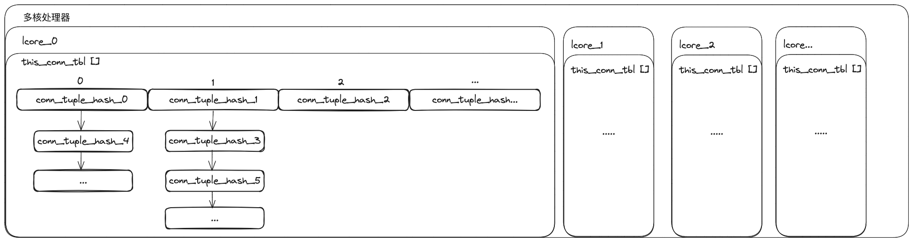
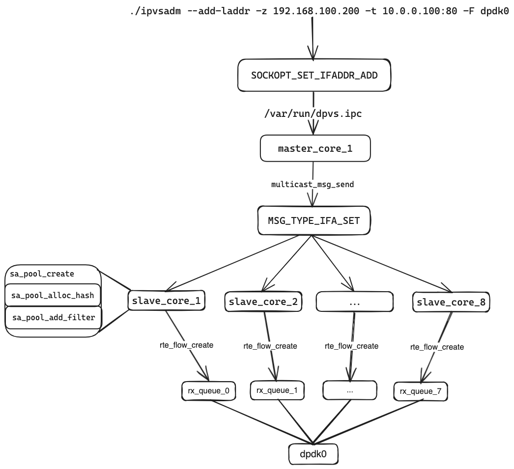
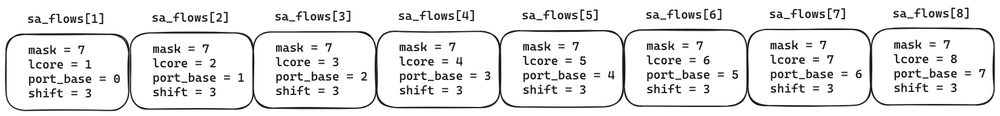
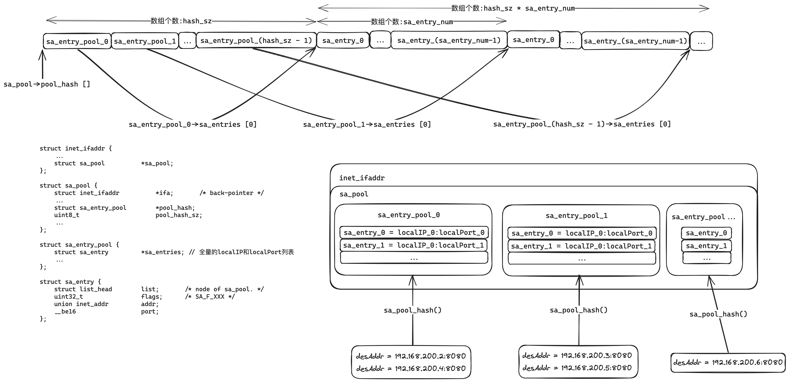

# DPVS是怎么在fullNat模式下做到inbound和outbound都被同一个lcore处理的

## 开篇词
在上一篇文章中，我们梳理了DPVS是怎么处理数据包并将其转发到后端服务的。那么接下来我们来解决另外一个问题，这个问题不仅对于我们理解DPVS是怎么在fullNat模式下高效工作的，而且对于我们搞懂怎么创建`dp_vs_conn`连接、Real Server的调度算法和转发模式具有启发作用。

## 问题是怎么产生的
1. 下面的`dp_vs_conn_tbl`会保存所属lcore的所有`dp_vs_conn`对象，可以看出代表in/outbound的`dp_vs_conn`对象，是由某个lcore单独持有的

    ```c

    #define RTE_PER_LCORE(name) (per_lcore_##name)

    #define RTE_DEFINE_PER_LCORE(type, name)			\
        __thread __typeof__(type) per_lcore_##name

    #define this_conn_tbl  (RTE_PER_LCORE(dp_vs_conn_tbl))

    static RTE_DEFINE_PER_LCORE(struct list_head *, dp_vs_conn_tbl);
    ```
2. 参考前面的架构图，当我们从Real Server方向接受到一个数据包时，该怎么找到对应lcore所存储的`dp_vs_conn`对象实例呢？因为这样我们才能根据`dp_vs_conn`找到对应的inbound信息，并把数据包转发给Client。但是如果dpdk接收的数据包后是随机将其交给某个lcore处理的话，那就有可能因为找不到`dp_vs_conn`导致转发失败。下面的分析都是基于这个架构图的配置
   

## 自上而下先给出答案
DPVS的做法是将数据包属于哪个lcore处理的信息，存在TCP端口中，即`dp_vs_conn`里面的lport字段，当数据包准备转发给Real Server时，会将当前的lcore与lport做一个绑定（例如图中的12345），这样当dpvs收到Real Server发来的数据包时，就能根据destinationPort找到对应的lcore，从而找到对应的`dp_vs_conn`对象实例。DPVS通过DPDK提供的RSS/flow-director技术来解决这个问题

## 回到包处理开始的地方
1.既然解题的关键是`dp_vs_conn`里面的lport字段，那么我们就先看看这个lport值怎么产生的，lport是在首次收到数据包新建`dp_vs_conn`对象的时候被设置的，回看上一篇文章我们知道了DPVS收到数据包的处理流程，所以现在我们进入跟`dp_vs_conn`相关的方法

2.代码首先调用了`prot->conn_lookup()`方法，去查找本lcore是否已经创建`dp_vs_conn`对象，如果创建了就将保存的对象直接返回，但是由于此时我们是第一次发送数据，所以这里是没有的，这个方法会返回空，通过接下来的判空逻辑会调用`prot->conn_sched()`方法，他的实现方法是`tcp_conn_sched()`，接下来进入这个方法
```c
<!-- src/ipvs/ip_vs_core.c -->
static int __dp_vs_in(void *priv, struct rte_mbuf *mbuf,
                      const struct inet_hook_state *state, int af)
{
    struct dp_vs_iphdr iph;
    struct dp_vs_proto *prot;
    struct dp_vs_conn *conn;
    /** 
    dir表示方向，参考常规的互联网架构，
    - DPVS_CONN_DIR_INBOUND表示客户端发往服务端的请求
    - DPVS_CONN_DIR_OUTBOUND表示服务端对客户端的响应
    */
    int dir, verdict, err, related;
    bool drop = false;
    lcoreid_t cid, peer_cid;
    eth_type_t etype = mbuf->packet_type; /* FIXME: use other field ? */
    assert(mbuf && state);

    cid = peer_cid = rte_lcore_id();

    ...

    /*
    l4协议处理函数：
    &dp_vs_proto_udp
    &dp_vs_proto_tcp
    &dp_vs_proto_icmp6
    &dp_vs_proto_icmp
    */
    prot = dp_vs_proto_lookup(iph.proto);
    if (unlikely(!prot))
        return INET_ACCEPT;

    ...

    /* packet belongs to existing connection ? 
    1 dp_vs_proto_tcp.conn_lookup = tcp_conn_lookup
    */
    conn = prot->conn_lookup(prot, &iph, mbuf, &dir, false, &drop, &peer_cid);

    ...

    if (unlikely(!conn)) {
        /* try schedule RS and create new connection 
        1. dp_vs_proto_tcp.conn_sched = tcp_conn_sched
        */
        if (prot->conn_sched(prot, &iph, mbuf, &conn, &verdict) != EDPVS_OK) {
            /* RTE_LOG(DEBUG, IPVS, "%s: fail to schedule.\n", __func__); */
            return verdict;
        }

        /* only SNAT triggers connection by inside-outside traffic. */
        if (conn->dest->fwdmode == DPVS_FWD_MODE_SNAT)
            dir = DPVS_CONN_DIR_OUTBOUND;
        else
            dir = DPVS_CONN_DIR_INBOUND;
    } else {
        ...
    }

    ...

    /* holding the conn, need a "put" later. */
    if (dir == DPVS_CONN_DIR_INBOUND)
        return xmit_inbound(mbuf, prot, conn);
    else
        return xmit_outbound(mbuf, prot, conn);
}
```
1. 在做完一些数据包校验以后，会根据数据包的目的IP和目的端口，查找我们设置的`dp_vs_service`，他是通过ipvsadm设置：`./ipvsadm -A -t 10.0.0.100:80 -s rr`，他代表着我们对外提供服务的入口，假如`dp_vs_service`没有找到，显然我们可以丢弃这个包
2. 接下来我们进入`dp_vs_schedule()`，这里就是`dp_vs_conn`被创建的地方
```c
<!--src/ipvs/ip_vs_proto_tcp.c-->
static int tcp_conn_sched(struct dp_vs_proto *proto,
                          const struct dp_vs_iphdr *iph,
                          struct rte_mbuf *mbuf,
                          struct dp_vs_conn **conn,
                          int *verdict)
{
    struct tcphdr *th, _tcph;
    struct dp_vs_service *svc;

    assert(proto && iph && mbuf && conn && verdict);

    th = mbuf_header_pointer(mbuf, iph->len, sizeof(_tcph), &_tcph);
    if (unlikely(!th)) {
        *verdict = INET_DROP;
        return EDPVS_INVPKT;
    }

    ...

    /* only TCP-SYN without other flag can be scheduled : 只有syn的数据包能被scheduled调度，其他的flag一律丢弃
    下面的丢弃策略表明，当没有经过完整的tcp握手的情况下，dpvs是不会对数据包进行处理的，做丢弃处理，
    换句话说，客户端只有先发送syn包之后，才能享受dpvs的功能，
    三次握手是tcp必备的一个过程，那为什么上面还要这样强调呢？我们可以考虑这么一个场景，主备两台dpvs发生切换的时候，
    就会发生syn是master接收，主备切换的时候，ack就到了backup，但此时由于下面的这个逻辑这个ack就会被丢弃，可能造成服务异常
    */
    if (!th->syn || th->ack || th->fin || th->rst) {

        /* Drop tcp packet which is send to vip and !vport */
        if (g_defence_tcp_drop &&
                (svc = dp_vs_vip_lookup(iph->af, iph->proto,
                                    &iph->daddr, rte_lcore_id()))) {
            dp_vs_estats_inc(DEFENCE_TCP_DROP);
            *verdict = INET_DROP;
            return EDPVS_INVPKT;
        }

        *verdict = INET_ACCEPT;
        return EDPVS_INVAL;
    }

    // 通过目的端口和目的IP查找虚拟服务，这个虚拟服务代表着负载均衡器对外提供的公网IP和80端口（大多数提供的是公网IP和80端口）
    svc = dp_vs_service_lookup(iph->af, iph->proto, &iph->daddr, th->dest,
                               0, mbuf, NULL, rte_lcore_id());
    if (!svc) {
        /* Drop tcp packet which is send to vip and !vport */
        if (g_defence_tcp_drop &&
                (svc = dp_vs_vip_lookup(iph->af, iph->proto,
                                   &iph->daddr, rte_lcore_id()))) {
            dp_vs_estats_inc(DEFENCE_TCP_DROP);
            *verdict = INET_DROP;
            return EDPVS_INVPKT;
        }
        *verdict = INET_ACCEPT;
        return EDPVS_NOSERV;
    }
    // 能走到这里说明synproxy没有开启
    *conn = dp_vs_schedule(svc, iph, mbuf, false);
    if (!*conn) {
        *verdict = INET_DROP;
        return EDPVS_RESOURCE;
    }

    return EDPVS_OK;
}
```
1. 这里先根据调度算法，获取一个Real Server，表示要将数据包转发给这个服务做真正的业务处理。这里提供了多种调度算法：轮训（rr）、一致性hash，也是通过命令`./ipvsadm -A -t 10.0.0.100:80 -s rr`中的参数-s来设置的。这也是一个很好的研究方向，感兴趣的同学可以深入一下
2. 剩下的内容是做一下ICMP协议的处理、参数的填充和标志位的设置，由于我们设置的转发模式是fullNat，所以此时会进入方法`dp_vs_conn_new`中
```c
<!-- src/ipvs/ip_vs_core.c -->
struct dp_vs_conn *dp_vs_schedule(struct dp_vs_service *svc,
                                  const struct dp_vs_iphdr *iph,
                                  struct rte_mbuf *mbuf,
                                  bool is_synproxy_on)
{
    uint16_t _ports[2], *ports; /* sport, dport */
    struct dp_vs_dest *dest;
    struct dp_vs_conn *conn;
    struct dp_vs_conn_param param;
    uint32_t flags = 0;

    assert(svc && iph && mbuf);

    ports = mbuf_header_pointer(mbuf, iph->len, sizeof(_ports), _ports);
    if (!ports)
        return NULL;

    /* persistent service */
    if (svc->flags & DP_VS_SVC_F_PERSISTENT)
        return dp_vs_sched_persist(svc, iph,  mbuf, is_synproxy_on);

    /**
    根据调度算法，获取rs节点
    1. 一致性hash调度: dp_vs_conhash_scheduler.dp_vs_conhash_schedule
     */
    dest = svc->scheduler->schedule(svc, mbuf, iph);
    if (!dest) {
        RTE_LOG(INFO, IPVS, "%s: no dest found.\n", __func__);
#ifdef CONFIG_DPVS_MBUF_DEBUG
        dp_vs_mbuf_dump("found dest failed.", iph->af, mbuf);
#endif
        return NULL;
    }

    if (dest->fwdmode == DPVS_FWD_MODE_SNAT)
        return dp_vs_snat_schedule(dest, iph, ports, mbuf);

    if (unlikely(iph->proto == IPPROTO_ICMP)) {
        ...
    } else if (unlikely(iph->proto == IPPROTO_ICMPV6)) {
        ...
    } else {
        /*
        caddr: 源IP/客户端IP
        vaddr: 目的IP/vip
        cport: 客户端源端口
        vport: 服务端目的端口
         */
        dp_vs_conn_fill_param(iph->af, iph->proto,
                              &iph->saddr, &iph->daddr,
                              ports[0], ports[1], 0, &param);
    }

    if (is_synproxy_on)
        flags |= DPVS_CONN_F_SYNPROXY;
    if (svc->flags & DP_VS_SVC_F_ONEPACKET && iph->proto == IPPROTO_UDP)
        flags |= DPVS_CONN_F_ONE_PACKET;
    if (svc->flags & DP_VS_SVC_F_EXPIRE_QUIESCENT)
        flags |= DPVS_CONN_F_EXPIRE_QUIESCENT;

    conn = dp_vs_conn_new(mbuf, iph, &param, dest, flags);
    if (!conn)
        return NULL;

    dp_vs_stats_conn(conn);
    return conn;
}
```

## dp_vs_conn的创建
这个方法就很重磅了，他构建了`dp_vs_conn`，其中有很重要的代表in/outbound的`conn_tuple_hash`对象还有本文的关键：**lport**
1. 调用`dp_vs_conn_alloc`从专属内存池分配内存，并将所属的内存池保存在他的`connpool`属性中，方便conn释放的时候重新回收进内存池
2. 决定Real Server的端口：`rport`，按照我们当前的环境，这里会被设置成`dest->port`，即Real Server对外提供服务的端口，假设是8080，这是通过命令：`./ipvsadm -a -t 10.0.0.100:80 -r 192.168.100.2:8080 -b`设置的，-b表示转发模式是fullNat
3. 接下来就是初始化in/outbound相关的信息了，通过`tuplehash_in`和`tuplehash_out`的定义我们可以看到，所谓inbound和outbound，就是`dp_vs_conn`的数组属性：`tuplehash`，通过下标区分inbound还是outbound。其中对于outbound的设置，我们可以看到daddr和dport分别被设置成了caddr和cport，而且`dp_vs_conn`的laddr和lport也是分别被设置成了caddr和cport，这对于fullNat的转发模式来说显然是不对的，caddr和cport分别表示的是客户端源IP和客户端源端口。那至于怎么正确被设置，后面会讲到，让我们继续往下看
4. 接下来就是对新创建的`dp_vs_conn`进行其他属性的初始化，其中我们关注下`dp_vs_conn_bind_dest`的调用，下面也给出了方法实现，其中最重要的是根据转发模式的不同选择对应的`packet_xmit`和`packet_out_xmit`实现，看过上篇文章的同学都知道这个函数的实现了DPDK网卡发送数据包核心函数：`rte_eth_tx_burst`的调用
5. 接下来就是上面提出的待解决的问题，在判断Real Server使用的转发模式是fullNat以后，进入`dp_vs_laddr_bind`处理，这里面会重新设置outbound的daddr和dport，也会重新设置`dp_vs_conn`的laddr和lport，这里我们先不展开这个方法，先把`dp_vs_conn_new`整个方法走完，防止兜兜转转头晕
6. 在上面正确的设置完对应的addr和port后，调用`dp_vs_conn_hash`，将in/outbound的信息加入`this_conn_tbl`，这个值就是我们在最开始提到的保存in/outbound信息的per_lcore列表，相关代码也贴到下面了
   
```c
enum {
    DPVS_CONN_DIR_INBOUND = 0,
    DPVS_CONN_DIR_OUTBOUND,
    DPVS_CONN_DIR_MAX,
};

#define tuplehash_in(c)         ((c)->tuplehash[DPVS_CONN_DIR_INBOUND])
#define tuplehash_out(c)        ((c)->tuplehash[DPVS_CONN_DIR_OUTBOUND])

struct dp_vs_conn *dp_vs_conn_new(struct rte_mbuf *mbuf,
                                  const struct dp_vs_iphdr *iph,
                                  struct dp_vs_conn_param *param,
                                  struct dp_vs_dest *dest, uint32_t flags)
{
    struct dp_vs_conn *new;
    struct conn_tuple_hash *t;
    uint16_t rport;
    __be16 _ports[2], *ports;
    int err;

    assert(mbuf && param && dest);

    // 分配内存，并设置conn的redirect、connpool属性
    new = dp_vs_conn_alloc(dest->fwdmode, flags);
    if (unlikely(!new))
        return NULL;

    new->flags = flags;

    /* set proper RS port */
    if (dp_vs_conn_is_template(new) || param->ct_dport != 0)
        rport = param->ct_dport;
    else if (dest->fwdmode == DPVS_FWD_MODE_SNAT) {
        if (unlikely(param->proto == IPPROTO_ICMP ||
                    param->proto == IPPROTO_ICMPV6)) {
            rport = param->vport;
        } else {
            ports = mbuf_header_pointer(mbuf, iph->len, sizeof(_ports), _ports);
            if (unlikely(!ports)) {
                RTE_LOG(WARNING, IPVS, "%s: no memory\n", __func__);
                goto errout;
            }
            rport = ports[0];
        }
    } else {
        rport = dest->port;
    }

    /* init inbound conn tuple hash */
    t = &tuplehash_in(new);
    t->direct   = DPVS_CONN_DIR_INBOUND;
    t->af       = param->af;
    t->proto    = param->proto;
    t->saddr    = *param->caddr;
    t->sport    = param->cport;
    t->daddr    = *param->vaddr;
    t->dport    = param->vport;
    INIT_LIST_HEAD(&t->list);

    /* init outbound conn tuple hash */
    t = &tuplehash_out(new);
    t->direct   = DPVS_CONN_DIR_OUTBOUND;
    t->af       = dest->af;
    t->proto    = param->proto;
    if (dest->fwdmode == DPVS_FWD_MODE_SNAT) {
        t->saddr = iph->saddr;
    } else {
        t->saddr = dest->addr;
    }
    t->sport    = rport;
    t->daddr    = *param->caddr;    /* non-FNAT */
    t->dport    = param->cport;     /* non-FNAT */
    INIT_LIST_HEAD(&t->list);

    /* init connection */
    new->af     = param->af;
    new->proto  = param->proto;
    new->caddr  = *param->caddr;
    new->cport  = param->cport;
    new->vaddr  = *param->vaddr;
    new->vport  = param->vport;
    new->laddr  = *param->caddr;    /* non-FNAT */
    new->lport  = param->cport;     /* non-FNAT */
    if (dest->fwdmode == DPVS_FWD_MODE_SNAT)
        new->daddr  = iph->saddr;
    else
        new->daddr  = dest->addr;
    new->dport  = rport; // 1.DPVS_FWD_MODE_FNAT: rport = dest->port

    if (dest->fwdmode == DPVS_FWD_MODE_FNAT) {
        new->pp_version = dest->svc->proxy_protocol;
        new->pp_sent = 0;
    }

    /* neighbour confirm cache */
    if (AF_INET == tuplehash_in(new).af) {
        new->in_nexthop.in.s_addr = htonl(INADDR_ANY);
    } else {
        new->in_nexthop.in6 = in6addr_any;
    }

    if (AF_INET == tuplehash_out(new).af) {
        new->out_nexthop.in.s_addr = htonl(INADDR_ANY);
    } else {
        new->out_nexthop.in6 = in6addr_any;
    }

    new->in_dev = NULL;
    new->out_dev = NULL;

    /* Controll member */
    new->control = NULL;
    rte_atomic32_clear(&new->n_control);

    /* caller will use it right after created,
     * just like dp_vs_conn_get(). */
    rte_atomic32_set(&new->refcnt, 1);
    new->state  = 0;
#ifdef CONFIG_DPVS_IPVS_STATS_DEBUG
    new->ctime = rte_rdtsc();
#endif

    /* bind destination and corresponding trasmitter */
    err = dp_vs_conn_bind_dest(new, dest);
    if (err != EDPVS_OK) {
        RTE_LOG(WARNING, IPVS, "%s: fail to bind dest: %s\n",
                __func__, dpvs_strerror(err));
        goto errout;
    }

    /* FNAT only: select and bind local address/port */
    if (dest->fwdmode == DPVS_FWD_MODE_FNAT) {
        // 在fullNat模式下，完成localPort的设置，实现两个方向的数据包都能被同一个core处理
        if ((err = dp_vs_laddr_bind(new, dest->svc)) != EDPVS_OK)
            goto unbind_dest;
    }

    /* init redirect if it exists */
    dp_vs_redirect_init(new);

    /* add to hash table (dual dir for each bucket) 
    将fullNat模式下重新设置localIP和localPort的conn重新放到hash表: this_conn_tbl，这样当回程数据到来的时候才能找到对应的conn
    */
    if ((err = dp_vs_conn_hash(new)) != EDPVS_OK)
        goto unbind_laddr;

    /* timer */
    new->timeout.tv_sec = conn_init_timeout;
    new->timeout.tv_usec = 0;

    /* synproxy */
    INIT_LIST_HEAD(&new->ack_mbuf);
    rte_atomic32_set(&new->syn_retry_max, 0);
    rte_atomic32_set(&new->dup_ack_cnt, 0);

    if ((flags & DPVS_CONN_F_SYNPROXY) && !dp_vs_conn_is_template(new)) {
        ...
    }

    /* schedule conn timer */
#ifdef CONFIG_TIMER_DEBUG
    snprintf(new->timer.name, sizeof(new->timer.name), "%s", "conn");
#endif
    dpvs_time_rand_delay(&new->timeout, 1000000);
    dp_vs_conn_attach_timer(new, true);

#ifdef CONFIG_DPVS_IPVS_DEBUG
    conn_dump("new conn: ", new);
#endif
    return new;

unbind_laddr:
    dp_vs_laddr_unbind(new);
unbind_dest:
    dp_vs_conn_unbind_dest(new, true);
errout:
    dp_vs_conn_free(new);
    return NULL;
}

<!-- src/ipvs/ip_vs_conn.c -->
static int dp_vs_conn_bind_dest(struct dp_vs_conn *conn,
                                struct dp_vs_dest *dest)
{
    /* ATTENTION:
     *   Initial state of conn should be INACTIVE, with conn->inactconns=1 and
     *   conn->actconns=0. We should not increase conn->actconns except in session
     *   sync.Generally, the INACTIVE and SYN_PROXY flags are passed down from
     *   the dest here. */
    conn->flags |= rte_atomic16_read(&dest->conn_flags);

    if (dest->max_conn &&
            (rte_atomic32_read(&dest->inactconns) + \
             rte_atomic32_read(&dest->actconns) >= dest->max_conn)) {
        dest->flags |= DPVS_DEST_F_OVERLOAD;
        return EDPVS_OVERLOAD;
    }

    rte_atomic32_inc(&dest->refcnt);

    if (dp_vs_conn_is_template(conn))
        rte_atomic32_inc(&dest->persistconns);
    else
        // 此时conn还在初始化中，所以当前conn应该计数到非活跃的范围：inactconns
        rte_atomic32_inc(&dest->inactconns);

    // 根据不同的转发模式，选择不同的转发函数
    switch (dest->fwdmode) {
    case DPVS_FWD_MODE_NAT:
        conn->packet_xmit = dp_vs_xmit_nat;
        conn->packet_out_xmit = dp_vs_out_xmit_nat;
        break;
    case DPVS_FWD_MODE_TUNNEL:
        conn->packet_xmit = dp_vs_xmit_tunnel;
        break;
    case DPVS_FWD_MODE_DR:
        conn->packet_xmit = dp_vs_xmit_dr;
        break;
    case DPVS_FWD_MODE_FNAT:
        conn->packet_xmit = dp_vs_xmit_fnat;
        conn->packet_out_xmit = dp_vs_out_xmit_fnat;
        break;
    case DPVS_FWD_MODE_SNAT:
        conn->packet_xmit = dp_vs_xmit_snat;
        conn->packet_out_xmit = dp_vs_out_xmit_snat;
        break;
    default:
        return EDPVS_NOTSUPP;
    }

    conn->dest = dest;
    return EDPVS_OK;
}
<!-- src/ipvs/ip_vs_conn.c -->
static inline int dp_vs_conn_hash(struct dp_vs_conn *conn)
{
    int err;

    if (conn->flags & DPVS_CONN_F_ONE_PACKET) {
        return EDPVS_OK;
    }

#ifdef CONFIG_DPVS_IPVS_CONN_LOCK
    rte_spinlock_lock(&this_conn_lock);
#endif
    // 将conn的tuplehash加入 this_conn_tbl
    err = __dp_vs_conn_hash(conn, DPVS_CONN_TBL_MASK);

#ifdef CONFIG_DPVS_IPVS_CONN_LOCK
    rte_spinlock_unlock(&this_conn_lock);
#endif
    // 将conn加入 dp_vs_cr_tbl
    dp_vs_redirect_hash(conn);

    return err;
}
<!-- src/ipvs/ip_vs_conn.c -->
static inline int __dp_vs_conn_hash(struct dp_vs_conn *conn, uint32_t mask)
{
    uint32_t ihash, ohash;

    if (unlikely(conn->flags & DPVS_CONN_F_HASHED))
        return EDPVS_EXIST;

    ihash = dp_vs_conn_hashkey(tuplehash_in(conn).af,
                         &tuplehash_in(conn).saddr, tuplehash_in(conn).sport,
                         &tuplehash_in(conn).daddr, tuplehash_in(conn).dport,
                         mask);
    // 因为在构建conn的时候已经把tuplehash_out的sport和dport反过来，所以这里不用再反过来
    ohash = dp_vs_conn_hashkey(tuplehash_out(conn).af,
                         &tuplehash_out(conn).saddr, tuplehash_out(conn).sport,
                         &tuplehash_out(conn).daddr, tuplehash_out(conn).dport,
                         mask);

    if (dp_vs_conn_is_template(conn)) {
        /* lock is complusory for template */
        rte_spinlock_lock(&dp_vs_ct_lock);
        list_add(&tuplehash_in(conn).list, &dp_vs_ct_tbl[ihash]);
        list_add(&tuplehash_out(conn).list, &dp_vs_ct_tbl[ohash]);
        rte_spinlock_unlock(&dp_vs_ct_lock);
    } else {
        list_add(&tuplehash_in(conn).list, &this_conn_tbl[ihash]);
        list_add(&tuplehash_out(conn).list, &this_conn_tbl[ohash]);
    }

    conn->flags |= DPVS_CONN_F_HASHED;
    rte_atomic32_inc(&conn->refcnt);

    return EDPVS_OK;
}
```

## 获取conn的laddr和lport
接下来继续深入方法`dp_vs_laddr_bind`，这个方法我们可以看到对conn的laddr和lport，以及outbound的daddr和dport做了重新的赋值，追踪源头是来自方法`sa_fetch`，这个方法会根据配置的laddr（laddr通过命令：`./ipvsadm --add-laddr -z 192.168.100.200 -t 10.0.0.100:80 -F dpdk0`配置，例如这里配置的是：192.168.100.200）和Real Server的IP，通过参数ssin携带端口值返回，继续深入这个方法
```c
<-- src/ipvs/ip_vs_laddr.c -->
int dp_vs_laddr_bind(struct dp_vs_conn *conn, struct dp_vs_service *svc)
{
    struct dp_vs_laddr *laddr = NULL;
    int i;
    uint16_t sport = 0;
    struct sockaddr_storage dsin, ssin;
    bool found = false;

    if (!conn || !conn->dest || !svc)
        return EDPVS_INVAL;
    if (svc->proto != IPPROTO_TCP && svc->proto != IPPROTO_UDP)
        return EDPVS_NOTSUPP;
    if (dp_vs_conn_is_template(conn))
        return EDPVS_OK;

    /*
     * some time allocate lport fails for one laddr,
     * but there's also some resource on another laddr.
     */
    for (i = 0; i < dp_vs_laddr_max_trails && i < svc->num_laddrs; i++) {
        /* select a local IP from service */
        laddr = __get_laddr(svc);
        if (!laddr) {
            RTE_LOG(ERR, IPVS, "%s: no laddr available.\n", __func__);
            return EDPVS_RESOURCE;
        }

        memset(&dsin, 0, sizeof(struct sockaddr_storage));
        memset(&ssin, 0, sizeof(struct sockaddr_storage));

        if (laddr->af == AF_INET) {
            struct sockaddr_in *daddr, *saddr;
            daddr = (struct sockaddr_in *)&dsin;
            daddr->sin_family = laddr->af;
            daddr->sin_addr = conn->daddr.in; // 设置目的地址destinaAddr为后端realService的IP
            daddr->sin_port = conn->dport; // 设置目的端口destinaPort为后端realService的端口
            saddr = (struct sockaddr_in *)&ssin;
            saddr->sin_family = laddr->af;
            saddr->sin_addr = laddr->addr.in; // 设置源地址sourceAddr为localIP
        } else {
            struct sockaddr_in6 *daddr, *saddr;
            daddr = (struct sockaddr_in6 *)&dsin;
            daddr->sin6_family = laddr->af;
            daddr->sin6_addr = conn->daddr.in6;
            daddr->sin6_port = conn->dport;
            saddr = (struct sockaddr_in6 *)&ssin;
            saddr->sin6_family = laddr->af;
            saddr->sin6_addr = laddr->addr.in6;
        }
        // dsin指向realService的IP和端口，ssin指向本地出口IP信息
        if (sa_fetch(laddr->af, laddr->iface, &dsin, &ssin) != EDPVS_OK) {
            char buf[64];
            if (inet_ntop(laddr->af, &laddr->addr, buf, sizeof(buf)) == NULL)
                snprintf(buf, sizeof(buf), "::");

            put_laddr(laddr);
            continue;
        }

        sport = (laddr->af == AF_INET ? (((struct sockaddr_in *)&ssin)->sin_port)
                : (((struct sockaddr_in6 *)&ssin)->sin6_port));
        // true表示了可以使用的
        found = true;
        break;
    }

    if (!found) {
#ifdef CONFIG_DPVS_IPVS_DEBUG
        RTE_LOG(ERR, IPVS, "%s: [%02d] no lip/lport available !!\n",
                __func__, rte_lcore_id());
#endif
        return EDPVS_RESOURCE;
    }

    rte_atomic32_inc(&laddr->conn_counts);

    /* overwrite related fields in out-tuplehash and conn */
    conn->laddr = laddr->addr;
    conn->lport = sport;
    tuplehash_out(conn).daddr = laddr->addr;
    tuplehash_out(conn).dport = sport;

    conn->local = laddr;
    return EDPVS_OK;
}
```


假设我们现在是ipv4的环境，继续进入`sa4_fetch`
```c
<-- src/sa_pool.c -->
int sa_fetch(int af, struct netif_port *dev,
             const struct sockaddr_storage *daddr,
             struct sockaddr_storage *saddr)
{
    if (unlikely(daddr && daddr->ss_family != af))
        return EDPVS_INVAL;
    if (unlikely(saddr && saddr->ss_family != af))
        return EDPVS_INVAL;
    if (AF_INET == af)
        return sa4_fetch(dev, (const struct sockaddr_in *)daddr,
                (struct sockaddr_in *)saddr);
    else if (AF_INET6 == af)
        return sa6_fetch(dev, (const struct sockaddr_in6 *)daddr,
                (struct sockaddr_in6 *)saddr);
    else
        return EDPVS_NOTSUPP;
}
```
因为我们前面找到laddr并设置了saddr，所以我们直接通过saddr获取inet_ifaddr的sa_pool属性，所以这里有两个方法是关键：`sa_pool_hash`和`sa_pool_fetch`
1. `sa_pool_hash`是将Real Server的ip、port作为hashKey，从sa_pool获取存储sa_entry的池对象：sa_entry_pool
2. `sa_pool_fetch`是从上面的池获取一个空闲的sa_entry，这里面就保存着提前预分配的localIP和localPort，最后再维护相关的状态
可以看到，承载关键信息的端口号是从预分配的sa_entry中获取的，那么这个sa_entry是从哪里被预分配的呢？这里我们先暂时把这个问题挂起
```c
<!-- src/sa_pool.c -->
static int sa4_fetch(struct netif_port *dev,
                     const struct sockaddr_in *daddr,
                     struct sockaddr_in *saddr)
{
    struct inet_ifaddr *ifa;
    struct flow4 fl;
    struct route_entry *rt;
    int err;
    assert(saddr);

    if (saddr && saddr->sin_addr.s_addr != INADDR_ANY && saddr->sin_port != 0)
        return EDPVS_OK; /* everything is known, why call this function ? */

    /* if source IP is assiged, we can find ifa->sa_pool
     * without @daddr and @dev. */
    if (saddr->sin_addr.s_addr) {
        ifa = inet_addr_ifa_get(AF_INET, dev, (union inet_addr*)&saddr->sin_addr);
        if (!ifa)
            return EDPVS_NOTEXIST;

        if (!ifa->sa_pool) {
            RTE_LOG(WARNING, SAPOOL, "%s: fetch addr on IP without sapool.", __func__);
            inet_addr_ifa_put(ifa);
            return EDPVS_INVAL;
        }
        // sa_pool_fetch会覆盖掉 saddr->sin_addr.s_addr 的值
        err = sa_pool_fetch(sa_pool_hash(ifa->sa_pool,(struct sockaddr_storage *)daddr),
                            (struct sockaddr_storage *)saddr);
        if (err == EDPVS_OK)
            rte_atomic32_inc(&ifa->sa_pool->refcnt);
        inet_addr_ifa_put(ifa);
        return err;
    }

    /* try to find source ifa by @dev and @daddr */
    ...
}

/* hash dest's <ip/port>. if no dest provided, just use first pool. */
static inline struct sa_entry_pool *
sa_pool_hash(const struct sa_pool *ap, const struct sockaddr_storage *ss)
{
    uint32_t hashkey;
    assert(ap && ap->pool_hash && ap->pool_hash_sz >= 1);
    if (!ss)
        return &ap->pool_hash[0];

    if (ss->ss_family == AF_INET) {
        uint16_t vect[2];
        const struct sockaddr_in *sin = (const struct sockaddr_in *)ss;

        vect[0] = ntohl(sin->sin_addr.s_addr) & 0xffff;
        vect[1] = ntohs(sin->sin_port);
        hashkey = (vect[0] + vect[1]) % ap->pool_hash_sz;
        // 每个realService对应的IP和端口都对应一个sa_entry_pool
        return &ap->pool_hash[hashkey];
    } else if (ss->ss_family == AF_INET6) {
        uint32_t vect[5] = { 0 };
        const struct sockaddr_in6 *sin6 = (const struct sockaddr_in6 *)ss;

        vect[0] = sin6->sin6_port;
        memcpy(&vect[1], &sin6->sin6_addr, 16);
        hashkey = rte_jhash_32b(vect, 5, sin6->sin6_family) % ap->pool_hash_sz;

        return &ap->pool_hash[hashkey];
    } else {
        return NULL;
    }
}

/**
从pool的空闲列表取出可用的localIp和localPort
ss：sourceAddr
 */
static inline int sa_pool_fetch(struct sa_entry_pool *pool,
                                struct sockaddr_storage *ss)
{
    assert(pool && ss);

    struct sa_entry *ent;
    struct sockaddr_in *sin = (struct sockaddr_in *)ss;
    struct sockaddr_in6 *sin6 = (struct sockaddr_in6 *)ss;

    // 参数pool中的端口是在这个方法提前预分配的: sa_pool_alloc_hash
    ent = list_first_entry_or_null(&pool->free_enties, struct sa_entry, list);
    if (!ent) {
        pool->miss_cnt++;
        return EDPVS_RESOURCE;
    }

    if (ss->ss_family == AF_INET) {
        sin->sin_family = AF_INET;
        sin->sin_addr.s_addr = ent->addr.in.s_addr;
        sin->sin_port = ent->port;
    } else if (ss->ss_family == AF_INET6) {
        sin6->sin6_family = AF_INET6;
        sin6->sin6_addr = ent->addr.in6;
        sin6->sin6_port = ent->port;
    } else {
        return EDPVS_NOTSUPP;
    }

    // 标记为已使用
    ent->flags |= SA_F_USED;
    list_move_tail(&ent->list, &pool->used_enties);
    pool->used_cnt++;
    pool->free_cnt--;

    return EDPVS_OK;
}
```
## 调转方向之add-laddr命令的触发路径
1. 前面所有的介绍，都是围绕新连接怎么建立并最后引出怎么使用`sa_pool`，那么接下来我们从隧道的另一头挖挖看sa_pool是怎么被创建并提前预分配到pool里面的，这样我们就能从隧道的两头同时施工进而融会贯通。
2. 那么打通隧道另外一头的方向标是这么一个命令：`./ipvsadm --add-laddr -z 192.168.100.200 -t 10.0.0.100:80 -F dpdk0`，他是用来向dpdk0这个网卡添加一个localIP（192.168.100.200）的，当这个命令执行时，ipvsadm会向dpvs发送`SOCKOPT_SET_IFADDR_ADD`类型的消息，master core收到这个消息以后，会传递给slave core，进而每个slave core都会触发`sa_pool_create`方法，这套ipvsadm到master与slave之间的进程间通信流程，先挖个坑在后续的文章深入讲解，他们的关系如下图
   
3. 这个方法有两个核心方法调用：`sa_pool_alloc_hash`和`sa_pool_filter`，这两个方法都依赖一个关键参数`sa_flows`，在搞懂这个两个核心方法调用之前，需要先知道`sa_flows`是怎么被设置的，他是在dpvs初始化阶段调用方法`sa_pool_init`被设置的，代码已经贴在下面
   - `sa_pool_alloc_hash`：sa_entry_pool的创建
   - `sa_pool_add_filter`：调用`rte_flow_create`设置dpdk的flow-director 
4. 在方法`sa_pool_init`中，设置了每个slave worker的`sa_flow`的配置，按照配置文件：dpvs.conf.sample
的配置，最终会得到如下图这么一个`sa_flows[]`，这个`sa_flow`的port_base就是一个关键参数了，他决定了localPort的分配规则和接受数据包的时候，这个数据包会被放到网卡的哪个rx_queue上。
 
    
```c
<!-- src/sa_pool.c -->
/**
 * 当inet_ifaddr被添加的时候，这个方法会被每一个slave_core调用
 */
int sa_pool_create(struct inet_ifaddr *ifa, uint16_t low, uint16_t high)
{
    int err;
    struct sa_pool *ap;
    lcoreid_t cid = rte_lcore_id();

    if (cid > 64 || !((sa_lcore_mask & (1UL << cid)))) {
        if (cid == rte_get_main_lcore())
            return EDPVS_OK; /* no sapool on master */
        return EDPVS_INVAL;
    }

    low = low ? : DEF_MIN_PORT;
    high = high ? : DEF_MAX_PORT;

    if (!ifa || low > high || low == 0 || high >= MAX_PORT) {
        RTE_LOG(ERR, SAPOOL, "%s: bad arguments\n", __func__);
        return EDPVS_INVAL;
    }

    ap = rte_zmalloc(NULL, sizeof(struct sa_pool), 0);
    if (unlikely(!ap))
        return EDPVS_NOMEM;

    ap->ifa = ifa;
    ap->low = low;
    ap->high = high;
    ap->flags = 0;
    rte_atomic32_set(&ap->refcnt, 1);

    // sa_flows初始化方法: sa_pool_init
    // 根据sa_flows定义的规则，将localPort预先分配到地址池
    err = sa_pool_alloc_hash(ap, sa_pool_hash_size, &sa_flows[cid]);
    if (err != EDPVS_OK) {
        goto free_ap;
    }

    // 调用rte_flow接口，添加rte_flow规则，根据tcp/udp端口将数据包投送到指定rx队列
    err = sa_pool_add_filter(ifa, ap, cid);
    if (err != EDPVS_OK) {
        goto free_hash;
    }

    ifa->sa_pool = ap;

    /* inc ifa->refcnt to hold it */
    rte_atomic32_inc(&ifa->refcnt);
    return EDPVS_OK;

free_hash:
    sa_pool_free_hash(ap);
free_ap:
    rte_free(ap);
    return err;
}

<!-- src/sa_pool.c -->
int sa_pool_init(void)
{
    int shift;
    lcoreid_t cid;
    uint16_t port_base;

    /* enabled lcore should not change after init 
    如果使用的是：dpvs.conf.sample，那么
    cpu type为slave的数量：sa_nlcore = 8
    sa_lcore_mask = 0b111111110，表明从0开始，cpu_id第1到8位为slave
    */
    netif_get_slave_lcores(&sa_nlcore, &sa_lcore_mask);

    /* how many mask bits needed ? 0b1000 = 8 shift = 3 */
    for (shift = 0; (0x1<<shift) < sa_nlcore; shift++)
        ;
    if (shift >= 16)
        return EDPVS_INVAL; /* bad config */

    port_base = 0;
    for (cid = 0; cid < DPVS_MAX_LCORE; cid++) {
        if (cid >= 64 || !(sa_lcore_mask & (1L << cid))) // 通过前面的sa_lcore_mask掩码筛选出slave_core 费这老大劲服了
            continue;
        assert(rte_lcore_is_enabled(cid) && cid != rte_get_main_lcore());

        sa_flows[cid].mask = ~((~0x0) << shift); // = ~((~00000000) << 3) = ~((11111111) << 3) = ~((0x11111000)) = 0x00000111 = 7
        sa_flows[cid].lcore = cid;
        sa_flows[cid].port_base = htons(port_base); // port_base的角色其实更像是网卡的rx队列id，根据前面的配置，port_base的值是0~7，正好对应配置文件里面的rx队列id：rx_queue_ids
        sa_flows[cid].shift = shift;

        port_base++;
    }

    return EDPVS_OK;
}
```

在搞懂了`sa_flows[]`的创建结果以后，我们就可以继续深入`sa_pool_create()`核心调用之`sa_pool_alloc_hash`，这里就是前面新连接`dp_vs_conn`创建的时候，调用`sa_pool_hash`和`sa_pool_fetch`获取包含localPort了的`sa_entry`的**预分配生产车间**了，到了此时，两道隧道之间可以说是初见曙光了

## sa_pool的创建
1. 这个方法会为添加的localIP分配一个sa_pool，sa_pool里面会保存一个sa_entry_pool数组：`pool_hash`，而sa_entry_pool里面会保存sa_entry数组，他们的内存布局和引用关系可以看这个图
   
2. 在计算端口值port的时候，有一个筛选逻辑：`flow->mask &&
((uint16_t)port & flow->mask) != ntohs(flow->port_base)`，他通过`flow->mask`掩码计算后port的后`flow->shift`位值是什么，比如`flow->mask=7、flow_shift=3`，那么他就会通过&与运算计算出port的后三位的值，当这个值和`flow->port_base`相等时，那么表明当前这个port值是可以加入sa_entry_pool里面，否则就跳过这个port，继续下一个port值进行判断。也就是说当这个sa_entry_pool构建完成以后，他池里面的所有端口后3位都是一样的。
1. 那么port_base和最终计算出来符合这个筛选逻辑的端口port如下表所示，我们可以看到slave_lcore_id为1他对应的是`sa_flows[1]`，所以他此时的port_base是0，那么此时这个slave lcore无论localIP被设置成什么，他能使用的端口就是localPortList列出来的这些，这个表格还有很关键的一列：`dpdk0_rx_queue_id`，他表示当前`slave lcore`绑定的多队列网卡dpdk0的`rx_queue_id`，这个是在配置文件`dpvs.conf.sample`里面就绑定好的，同时还表示与`port_base`的绑定关系，那与`port_base`的绑定关系是在哪里定义的呢？这就要进入`sa_pool_crate`里面的另外一个核心调用：`sa_pool_add_filter`
    | slave_lcore_id | dpdk0_rx_queue_id | port_base | localPortList |
    |-----------|-----------|-----------|------------------------------------------------------------------------|
    | 1         | 0         | 0         | [1032, 1040, 1048, 1056, 1064, ..., 65504, 65512, 65520, 65528]        |
    | 2         | 1         | 1         | [1025, 1033, 1041, 1049, 1057, ..., 65505, 65513, 65521, 65529]        |
    | 3         | 2         | 2         | [1026, 1034, 1042, 1050, 1058, ..., 65506, 65514, 65522, 65530]        |
    | 4         | 3         | 3         | [1027, 1035, 1043, 1051, 1059, ..., 65507, 65515, 65523, 65531]        |
    | 5         | 4         | 4         | [1028, 1036, 1044, 1052, 1060, ..., 65508, 65516, 65524, 65532]        |
    | 6         | 5         | 5         | [1029, 1037, 1045, 1053, 1061, ..., 65509, 65517, 65525, 65533]        |
    | 7         | 6         | 6         | [1030, 1038, 1046, 1054, 1062, ..., 65510, 65518, 65526, 65534]        |
    | 8         | 7         | 7         | [1031, 1039, 1047, 1055, 1063, ..., 65511, 65519, 65527, 65535]        |


```c
static int sa_pool_alloc_hash(struct sa_pool *ap, uint8_t hash_sz,
                               const struct sa_flow *flow)
{
    int hash;
    struct sa_entry_pool *pool;
    struct sa_entry * sep;
    uint32_t port; /* should be u32 or 65535==0 */
    uint32_t sa_entry_pool_size;
    uint32_t sa_entry_size;
    uint32_t sa_entry_num;

    sa_entry_num = MAX_PORT >> flow->shift; // (65536 >> flow->shift) = (2^16 >> flow->shift) = 2^(16 - 3) = 8192（意味着一个地址池sa_entry_pool最多存8192个端口） 
    sa_entry_pool_size = sizeof(struct sa_entry_pool) * hash_sz; // 这个是sa_entry_pool所需要的空间
    sa_entry_size = sizeof(struct sa_entry) * sa_entry_num * hash_sz; // 这个是sa_entry所需要的空间

    /* pool_hash是个sa_entry_pool数组，需要hash_sz个sa_entry_pool，而每个sa_entry_pool又需要sa_entry_num个sa_entry，
    所以需要计算出sa_entry_pool_size+sa_entry_size，这样sa_entry_pool和sa_entry就能放在同一块内存上
    */
    ap->pool_hash = rte_malloc(NULL, sa_entry_pool_size + sa_entry_size,
                               RTE_CACHE_LINE_SIZE);
    if (!ap->pool_hash)
        return EDPVS_NOMEM;

    ap->pool_hash_sz = hash_sz;
    sep = (struct sa_entry *)&ap->pool_hash[hash_sz]; // 将pool_hash的结尾作为sa_entry数组的起始地址

    /**  the big loop may take tens of milliseconds
     因为port是自增+1的，导致最多需要自增2^flow->shift次，才能找到一个合适的port，这其中耗费的时间可能是不必要的，可以是一个优化点
     虽然可以优化，但是考虑这个使用场景并不是频繁的，而且下面这个代码可读性也是比较好的，所以也还行。。。┓( ´∀` )┏
     */
    for (hash = 0; hash < hash_sz; hash++) {
        // 遍历ap的sa_entry_pool数组
        pool = &ap->pool_hash[hash];

        INIT_LIST_HEAD(&pool->used_enties);
        INIT_LIST_HEAD(&pool->free_enties);

        pool->used_cnt = 0;
        pool->free_cnt = 0;
        pool->shift = flow->shift;
        pool->sa_entries = &sep[sa_entry_num * hash]; // 获取sa_entry数组的起始地址

        for (port = ap->low; port <= ap->high; port++) {
            struct sa_entry *sa;

            // 从这个判断逻辑可以看出，pool里面的port是跟core相关的，可以根据port判断他应该是属于哪个lcore处理
            if (flow->mask &&
                ((uint16_t)port & flow->mask) != ntohs(flow->port_base))
                // 端口后mask位是port_base的，才能被使用
                continue;

            sa = &pool->sa_entries[(uint16_t)(port >> pool->shift)]; // 以port的前(16 - pool->shift)位作为索引下标
            sa->addr = ap->ifa->addr;
            sa->port = htons((uint16_t)port);
            list_add_tail(&sa->list, &pool->free_enties);
            pool->free_cnt++;
        }
    }
    /**
    总结：当加载dpvs.config.sample时，flow->shift = 4，
        所以会使用端口号的后4位作为数据包该由哪个CPU处理的依据，
        把端口号的前12位作为pool->sa_entries的索引下标
     */
    return EDPVS_OK;
}
```
## lport与rx_queue_id的绑定
这里拿到了当前slave_lcore所属的`sa_flow`，并且取出了它的`port_base`和`mask`，除此之外按照本文参考的架构，还有`ifa->idev->dev`为dpdk0、`ifa->addr`为192.168.100.200。那么继续深入`netif_sapool_flow_add`
```c
static int sa_pool_add_filter(struct inet_ifaddr *ifa, struct sa_pool *ap,
                             lcoreid_t cid)
{
    int err;
    // 获取cid所属的flow规则
    struct sa_flow *flow = &sa_flows[cid];

    netif_flow_handler_param_t flow_handlers = {
            .size     = MAX_SA_FLOW,
            .flow_num = 0,
            .handlers = ap->flows,
    };

    if (!sapool_flow_enable)
        return EDPVS_OK;

    err = netif_sapool_flow_add(ifa->idev->dev, cid, ifa->af, &ifa->addr,
            flow->port_base, htons(flow->mask), &flow_handlers);
    ap->flow_num = flow_handlers.flow_num;

    return err;
}
```
这里会构建flow规则，即用来告诉dpdk0，现在构建的是一个入站流规则，当收到ip是192.168.100.200，而且通过掩码&与运算tcp/udp端口的结果是port_base的时候，就把他投送到cid对应的rx_queue上。此时我们知道了前面说的port_base与rx_queue_id的绑定发生在什么地方了，剩下的就是通过调用`netif_flow_create`把构建的规则传递给dpdk，继续进入这个方法
```c
<!-- src/netif_flow.c -->
int netif_sapool_flow_add(struct netif_port *dev, lcoreid_t cid,
            int af, const union inet_addr *addr,
            __be16 port_base, __be16 port_mask,
            netif_flow_handler_param_t *flows)
{
    int err, ret = EDPVS_OK, nflows = 0;
    char ipbuf[64];
    struct rte_flow_attr attr = {
        .group    = NETIF_FLOW_GROUP,
        .priority = NETIF_FLOW_PRIO_SAPOOL,
        .ingress  = 1, // 表示这是一个入站流规则
        .egress   = 0, // 表示这不是一个出站流规则
        //.transfer = 0,
    };
    struct rte_flow_item pattern[SAPOOL_PATTERN_NUM];
    struct rte_flow_action action[SAPOOL_ACTION_NUM];
    netif_flow_handler_param_t resp;

    struct rte_flow_item_ipv4 ip_spec, ip_mask;
    struct rte_flow_item_ipv6 ip6_spec, ip6_mask;
    struct rte_flow_item_tcp tcp_spec, tcp_mask;
    struct rte_flow_item_udp udp_spec, udp_mask;

    queueid_t queue_id;
    struct rte_flow_action_queue queue;

    if (unlikely(!dev || !addr || !flows))
        return EDPVS_INVAL;
    if (unlikely(flows->size < 4 || !flows->handlers))
        return EDPVS_INVAL;

    memset(pattern, 0, sizeof(pattern));
    memset(action, 0, sizeof(action));

    /* create action stack 获取这个CPU在这个dev网卡上的rx_queue_id */
    err = netif_get_queue(dev, cid, &queue_id);
    if (unlikely(err != EDPVS_OK))
        return err;
    queue.index = queue_id;
    action[0].type = RTE_FLOW_ACTION_TYPE_QUEUE; // 类型：将数据包分发到指定的队列索引
    action[0].conf = &queue; // 指定队列索引
    action[1].type = RTE_FLOW_ACTION_TYPE_END;

    /* create pattern stack */
    pattern[0].type = RTE_FLOW_ITEM_TYPE_ETH; // 匹配以太帧

    if (af == AF_INET) {
        memset(&ip_spec, 0, sizeof(struct rte_flow_item_ipv4));
        memset(&ip_mask, 0, sizeof(struct rte_flow_item_ipv4));
        ip_spec.hdr.dst_addr = addr->in.s_addr; // 指定要匹配的具体Ipv4地址
        ip_mask.hdr.dst_addr = htonl(0xffffffff); // 匹配ipv4的所有位
        pattern[1].type = RTE_FLOW_ITEM_TYPE_IPV4; // 匹配IPv4数据包
        pattern[1].spec = &ip_spec; //
        pattern[1].mask = &ip_mask;
    } else if (af == AF_INET6) {
        memset(&ip6_spec, 0, sizeof(struct rte_flow_item_ipv6));
        memset(&ip6_mask, 0, sizeof(struct rte_flow_item_ipv6));
        memcpy(&ip6_spec.hdr.dst_addr, &addr->in6, sizeof(ip6_spec.hdr.dst_addr));
        memset(&ip6_mask.hdr.dst_addr, 0xff, sizeof(ip6_mask.hdr.dst_addr));
        pattern[1].type = RTE_FLOW_ITEM_TYPE_IPV6;
        pattern[1].spec = &ip6_spec;
        pattern[1].mask = &ip6_mask;
    } else {
        return EDPVS_INVAL;
    }
    memset(&tcp_spec, 0, sizeof(struct rte_flow_item_tcp));
    memset(&tcp_mask, 0, sizeof(struct rte_flow_item_tcp));
    tcp_spec.hdr.dst_port = port_base; // 指定要匹配的具体端口号
    tcp_mask.hdr.dst_port = port_mask; // 指定匹配端口号的掩码
    pattern[2].type = RTE_FLOW_ITEM_TYPE_TCP; // 匹配TCP数据包
    pattern[2].spec = &tcp_spec;
    pattern[2].mask = &tcp_mask;
    pattern[3].type = RTE_FLOW_ITEM_TYPE_END;

    /* set tcp flow */
    resp.size = flows->size;
    resp.flow_num = 0;
    resp.handlers = &flows->handlers[0];
    err = netif_flow_create(dev, &attr, pattern, action, &resp);
    if (err) {
        ret = EDPVS_RESOURCE;
        RTE_LOG(ERR, FLOW, "%s: adding tcp sapool flow failed: %s ip %s port %d(0x%04X) mask 0x%04X,"
                " queue %d lcore %2d\n", __func__, dev->name,
                inet_ntop(af, addr, ipbuf, sizeof(ipbuf)) ? : "::",
                ntohs(port_base), ntohs(port_base), ntohs(port_mask), queue_id, cid);
    } else {
        nflows += resp.flow_num;
        RTE_LOG(INFO, FLOW, "%s: adding tcp sapool flow succeed: %s ip %s port %d(0x%04X) mask 0x%04X,"
                " queue %d lcore %2d\n", __func__, dev->name,
                inet_ntop(af, addr, ipbuf, sizeof(ipbuf)) ? : "::",
                ntohs(port_base), ntohs(port_base), ntohs(port_mask), queue_id, cid);
    }

    memset(&udp_spec, 0, sizeof(struct rte_flow_item_udp));
    memset(&udp_mask, 0, sizeof(struct rte_flow_item_udp));
    udp_spec.hdr.dst_port = port_base; // 和TCP保持了一样的设置规则
    udp_mask.hdr.dst_port = port_mask;
    pattern[2].type = RTE_FLOW_ITEM_TYPE_UDP; // 匹配UDP数据包
    pattern[2].spec = &udp_spec;
    pattern[2].mask = &udp_mask;
    /* set udp flow */
    resp.size = flows->size - nflows;
    resp.flow_num = 0;
    resp.handlers = &flows->handlers[nflows];
    err = netif_flow_create(dev, &attr, pattern, action, &resp);
    if (err) {
        ret = EDPVS_RESOURCE;
        RTE_LOG(ERR, FLOW, "%s: adding udp sapool flow failed: %s ip %s port %d(0x%04X) mask 0x%04X,"
                " queue %d lcore %2d\n", __func__, dev->name,
                inet_ntop(af, addr, ipbuf, sizeof(ipbuf)) ? : "::",
                ntohs(port_base), ntohs(port_base), ntohs(port_mask), queue_id, cid);
    } else {
        nflows += resp.flow_num;
        RTE_LOG(INFO, FLOW, "%s: adding udp sapool flow succeed: %s ip %s port %d(0x%04X) mask 0x%04X,"
                " queue %d lcore %2d\n", __func__, dev->name,
                inet_ntop(af, addr, ipbuf, sizeof(ipbuf)) ? : "::",
                ntohs(port_base), ntohs(port_base), ntohs(port_mask), queue_id, cid);
    }

    flows->flow_num = nflows;
    return ret;
}
```

这里会根据dev的不同类型做不同处理，由于我们添加的dpdk0是普通网卡，我们继续进入`__netif_flow_create`
```c
<!-- src/netif_flow.c -->
static int netif_flow_create(struct netif_port *dev,
            const struct rte_flow_attr *attr,
            const struct rte_flow_item pattern[],
            const struct rte_flow_action actions[],
            netif_flow_handler_param_t *flows)
{
    int err;

    if (unlikely(!dev || !flows))
        return EDPVS_INVAL;

    if (dev->type == PORT_TYPE_VLAN) {
        struct vlan_dev_priv *vlan = netif_priv(dev);
        if (unlikely(!vlan || !vlan->real_dev))
            return EDPVS_INVAL;
        dev = vlan->real_dev;
    }

    if (dev->type == PORT_TYPE_GENERAL) {
        // 对普通网卡设备做flow设置
        if (unlikely(flows->size < 1 || !flows->handlers))
            return EDPVS_INVAL;
        err = __netif_flow_create(dev, attr, pattern, actions, &flows->handlers[0]);
        flows->flow_num = (err == EDPVS_OK) ? 1 : 0;
        return err;
    }

    /*
    为什么dev->type 有PORT_TYPE_BOND_MASTER和PORT_TYPE_BOND_SLAVE的分别?
    answer: relate_bonding_device 聚合网卡，防止单点网卡故障
    */ 
    if (dev->type == PORT_TYPE_BOND_MASTER) {
        // 对bonding聚合网卡做flow设置
        int i, slave_nb;
        slave_nb = dev->bond->master.slave_nb;

        if (unlikely(flows->size < slave_nb || !flows->handlers))
            return EDPVS_INVAL;
        for (i = 0; i < slave_nb; i++) {
            // 对bonding接口做flow，本质上是对普通网卡做flow
            err = __netif_flow_create(dev->bond->master.slaves[i], attr, pattern, actions, &flows->handlers[i]);
            if (err != EDPVS_OK) {
                while (--i >= 0)
                    __netif_flow_destroy(&flows->handlers[i]);
                return err;
            }
        }
        flows->flow_num = slave_nb;
        return EDPVS_OK;
    }

    return EDPVS_INVAL;
}
```
我们看到调用了`rte_flow_create`，他就是将我们刚才定义的规则在指定的网卡上创建，流程走到这里也就大结局了，相信大家就能解答最开始提出的那个问题了
```c
static inline int __netif_flow_create(struct netif_port *dev,
            const struct rte_flow_attr *attr,
            const struct rte_flow_item pattern[],
            const struct rte_flow_action actions[],
            struct netif_flow_handler *flow)
{
    struct rte_flow_error flow_error;

    if (unlikely(!flow || !dev || (dev->type != PORT_TYPE_GENERAL &&
                dev->type != PORT_TYPE_BOND_SLAVE)))
        // 只对一般物理网卡有效
        return EDPVS_INVAL;

    netif_flow_lock(dev);
    if (rte_flow_validate(dev->id, attr, pattern, actions, &flow_error)) {
        netif_flow_unlock(dev);
        RTE_LOG(WARNING, FLOW, "rte_flow_validate on %s failed -- %d, %s\n",
                dev->name, flow_error.type, flow_error.message);
        return EDPVS_DPDKAPIFAIL;
    }

    flow->handler = rte_flow_create(dev->id, attr, pattern, actions, &flow_error);
    netif_flow_unlock(dev);
    if (!flow->handler) {
        flow->pid = 0;
        RTE_LOG(WARNING, FLOW, "rte_flow_create on %s failed -- %d, %s\n",
                dev->name, flow_error.type, flow_error.message);
        return EDPVS_DPDKAPIFAIL;
    }
    flow->pid = dev->id;

    return EDPVS_OK;
}
```
## 彩蛋之RSS的配置

在dpvs启动的时候，会调用下面这个方法，给每个网卡设备设置的队列规则是轮训，即收到数据包后会雨露均沾的发给每个rx_queue，但是它的优先级没有前面添加的flow高
```c
static int __netif_update_rss_reta(struct netif_port *port)
{
    int i, err;
    int nrssq = NETIF_MAX_QUEUES;
    queueid_t rssq[NETIF_MAX_QUEUES];
    uint32_t reta_id, reta_pos;
    struct rte_eth_rss_reta_entry64 reta_conf[RETA_CONF_SIZE];

    if (port->type != PORT_TYPE_GENERAL && port->type != PORT_TYPE_BOND_SLAVE)
        return EDPVS_NOTSUPP;

    if (port->type == PORT_TYPE_BOND_SLAVE)
        err = get_configured_rss_queues(port->bond->slave.master->id, rssq, &nrssq);
    else
        err = get_configured_rss_queues(port->id, rssq, &nrssq);
    if (err != EDPVS_OK)
        return err;
#ifdef CONFIG_DPVS_NETIF_DEBUG
    printf("RSS QUEUES(%s): ", port->name);
    for (i = 0; i < nrssq; i++) {
        printf("%-4d", rssq[i]);
    }
    printf("\n");
#endif

    memset(reta_conf, 0, sizeof(reta_conf));
    for (i = 0; i < port->dev_info.reta_size; i++) {
        reta_id = i / RTE_RETA_GROUP_SIZE;
        reta_pos = i % RTE_RETA_GROUP_SIZE;
        reta_conf[reta_id].mask = UINT64_MAX;
        reta_conf[reta_id].reta[reta_pos] = (uint16_t)(rssq[i % nrssq]);
    }

    if (rte_eth_dev_rss_reta_update(port->id, reta_conf, port->dev_info.reta_size))
        return EDPVS_DPDKAPIFAIL;

    netif_dump_rss_reta(port);
    return EDPVS_OK;
}
```
