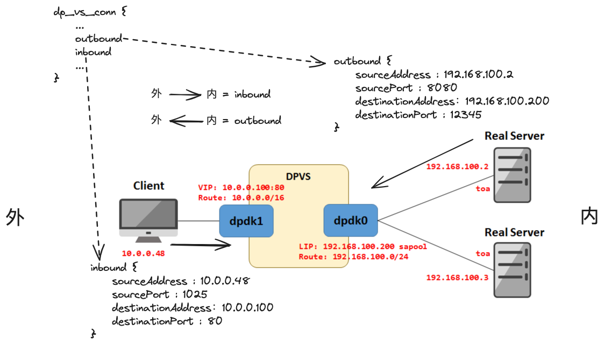

# 开篇词
在上一篇文章中，我们知道了DPVS是怎么跑起来的，知道了他在哪里接受数据并将数据放到了哪个位置，那么这篇文章就继续介绍DPVS在接受了数据以后是怎么处理并发送给后端realService的

## 书接上回
我们在`lcore_stats_burst`方法将网卡收到的数据保存到`qconf->mbufs`变量中，然后通过`lcore_process_packets`方法将这些数据包进行处理
```C
<!-- dpvs/src/netif.c -->
static void lcore_job_recv_fwd(void *arg)
{
    int i, j;
    portid_t pid;
    lcoreid_t cid;
    struct netif_queue_conf *qconf;

    cid = rte_lcore_id();
    assert(LCORE_ID_ANY != cid);

    for (i = 0; i < lcore_conf[lcore2index[cid]].nports; i++) {
        // 遍历当前lcore的nic端口
        pid = lcore_conf[lcore2index[cid]].pqs[i].id;
        assert(pid <= bond_pid_end);

        for (j = 0; j < lcore_conf[lcore2index[cid]].pqs[i].nrxq; j++) {
            // 遍历当前nic端口对应的rx队列
            qconf = &lcore_conf[lcore2index[cid]].pqs[i].rxqs[j];
            // 提前处理 arp_ring 队列，用于处理arp请求形成邻居表
            lcore_process_arp_ring(cid);
            // 提前处理 dp_vs_redirect_ring 队列
            lcore_process_redirect_ring(cid);
            // 从nic的rx队列中取出数据包
            qconf->len = netif_rx_burst(pid, qconf);
            // 记录lcore的收包统计信息
            lcore_stats_burst(&lcore_stats[cid], qconf->len);
            // 处理每个接受队列里的数据包
            lcore_process_packets(qconf->mbufs, cid, qconf->len, 0);
        }
    }
}
```
## 深入虎穴
接下来我们进入`lcore_process_packets`方法，这里会将数据包通过方法`rte_prefetch0`提前缓存到CPU cache中，以加速数据包的处理，可以看到这里的主要逻辑是把mbuf数组分割成单个mbuf逐个处理，每个mbuf通过`netif_deliver_mbuf`处理
```C
<!-- dpvs/src/netif.c -->
void lcore_process_packets(struct rte_mbuf **mbufs, lcoreid_t cid, uint16_t count, bool pkts_from_ring)
{
    int i, t;

    /* prefetch packets */
    for (t = 0; t < count && t < NETIF_PKT_PREFETCH_OFFSET; t++)
        rte_prefetch0(rte_pktmbuf_mtod(mbufs[t], void *));

    /* L2 filter */
    for (i = 0; i < count; i++) {
        struct rte_mbuf *mbuf = mbufs[i];
        struct netif_port *dev = netif_port_get(mbuf->port);

        if (unlikely(!dev)) {
            rte_pktmbuf_free(mbuf);
            lcore_stats[cid].dropped++;
            continue;
        }
        // bonding聚合类型的端口，实际处理对应的设备是master
        if (dev->type == PORT_TYPE_BOND_SLAVE) {
            dev = dev->bond->slave.master;
            mbuf->port = dev->id;
        }

        mbuf->tx_offload = 0; /* reset l2_len, l3_len, l4_len, ... */

        if (t < count) {
            rte_prefetch0(rte_pktmbuf_mtod(mbufs[t], void *));
            t++;
        }

        /* handler should free mbuf 分割单个mbuf并进行处理 */
        netif_deliver_mbuf(dev, cid, mbuf, pkts_from_ring);
    }
}
```
接下来我们查看`netif_deliver_mbuf`方法，这里也是一些细枝末节的处理，例如kni、traffic control，这里我们暂时跳过这些细小的分支，继续深入方法`netif_rcv_mbuf`源码
```C
<!-- dpvs/src/netif.c -->
/**
pkts_from_ring：指明mbuf是否来自ring，有可能是来自前面的 dp_vs_redirect_ring arp_ring
 */
static int netif_deliver_mbuf(struct netif_port *dev, lcoreid_t cid,
                  struct rte_mbuf *mbuf, bool pkts_from_ring)
{
    int ret = EDPVS_OK;
    struct rte_ether_hdr *eth_hdr;

    assert(mbuf->port <= NETIF_MAX_PORTS);
    assert(dev != NULL);

    eth_hdr = rte_pktmbuf_mtod(mbuf, struct rte_ether_hdr *);
    /* reuse mbuf.packet_type, it was RTE_PTYPE_XXX */
    mbuf->packet_type = eth_type_parse(eth_hdr, dev);

    /*
     * In NETIF_PORT_FLAG_FORWARD2KNI mode.
     * All packets received are deep copied and sent to KNI
     * for the purpose of capturing forwarding packets.Since the
     * rte_mbuf will be modified in the following procedure,
     * we should use mbuf_copy instead of rte_pktmbuf_clone.
     */
    if (dev->flag & NETIF_PORT_FLAG_FORWARD2KNI) {
        struct rte_mbuf *mbuf_copied = mbuf_copy(mbuf, pktmbuf_pool[dev->socket]);
        if (likely(mbuf_copied != NULL))
            kni_ingress(mbuf_copied, dev);
        else
            RTE_LOG(WARNING, NETIF, "%s: failed to copy mbuf for kni\n", __func__);
    }

    if (!pkts_from_ring && (dev->flag & NETIF_PORT_FLAG_TC_INGRESS)) {
        // 处理入站方向的traffic control
        mbuf = tc_hook(netif_tc(dev), mbuf, TC_HOOK_INGRESS, &ret);
        if (!mbuf)
            return ret;
    }

    return netif_rcv_mbuf(dev, cid, mbuf, pkts_from_ring);
}
```
这个方法的逻辑略显的多，简单来说，这里包含了处理vlan、arp应答包的逻辑，这些不详细展开讲，关键在于方法`pt->func(mbuf, dev)`的调用，pt是`pkt_type_get()`根据eth_hdr->ether_type筛选得到的协议处理函数，这里根据不同的协议有以下函数实现：ipv4_rcv、ip6_rcv、neigh_resolve_input，他们分别是处理ipv4协议、ipv6协议、arp协议，这里我们假设处理的是ipv4协议，那么我们继续深入`ipv4_rcv`
```c
<!-- dpvs/src/netif.c -->
int netif_rcv_mbuf(struct netif_port *dev, lcoreid_t cid, struct rte_mbuf *mbuf, bool pkts_from_ring)
{
    struct rte_ether_hdr *eth_hdr;
    struct pkt_type *pt;
    int err;
    uint16_t data_off;
    bool forward2kni;

    eth_hdr = rte_pktmbuf_mtod(mbuf, struct rte_ether_hdr *);
    /*
     * handle VLAN
     * if HW offload vlan strip, it's still need vlan module
     * to act as VLAN filter.
     */
    if (eth_hdr->ether_type == htons(ETH_P_8021Q) ||
            mbuf->ol_flags & PKT_RX_VLAN_STRIPPED) {
        ...
    }

    ...

    /* clone arp pkt to every queue */
    if (unlikely(pt->type == rte_cpu_to_be_16(RTE_ETHER_TYPE_ARP) && !pkts_from_ring)) {
        ...
    }

    mbuf->l2_len = sizeof(struct rte_ether_hdr);

    /* Remove ether_hdr at the beginning of an mbuf */
    data_off = mbuf->data_off;
    if (unlikely(NULL == rte_pktmbuf_adj(mbuf, sizeof(struct rte_ether_hdr))))
        goto drop;

    /* 
    针对不同的ether_type（0x0800：IPv4、0x0806：ARP、0x86DD：IPv6）调用不同的处理函数
    ipv4处理: &ip4_pkt_type.func = ipv4_rcv
    ipv6处理: &ip6_pkt_type.func = ip6_rcv
    arp协议包处理: &arp_pkt_type.func = neigh_resolve_input
    */
    err = pt->func(mbuf, dev);

    ...
}
```
`ipv4_rcv`这个方法需要关注的不多，主要是一些参数的校验，我们直接快进到最后一行函数的调用`INET_HOOK`，这个函数的最后一个参数`ipv4_rcv_fin`不要忽略掉，当`INET_HOOK`走到最后会调用这个函数，`INET_HOOK`这个函数借鉴了Linux的网络栈，方便对应用进行扩展
```c
<!-- dpvs/src/ipv4.c -->
static int ipv4_rcv(struct rte_mbuf *mbuf, struct netif_port *port)
{
    ...


    return INET_HOOK(AF_INET, INET_HOOK_PRE_ROUTING,
                     mbuf, port, NULL, ipv4_rcv_fin);
```
由于前面对`INET_HOOK`调用使用的参数是：AF_INET, INET_HOOK_PRE_ROUTING，所以下面的hook_list会有这两个实现并依次调用：dp_vs_pre_routing、dp_vs_in。下面看看这两个函数的实现，看看他们里面有什么需要我们关注的，我们先看`dp_vs_pre_routing`
```c
<!-- dpvs/src/inet.c -->
int INET_HOOK(int af, unsigned int hook, struct rte_mbuf *mbuf,
              struct netif_port *in, struct netif_port *out,
              int (*okfn)(struct rte_mbuf *mbuf))
{
    struct list_head *hook_list;
    struct inet_hook_ops *ops;
    struct inet_hook_state state;
    int verdict = INET_ACCEPT; // INET_ACCEPT表示mbuf符合要求已被处理

    state.hook = hook;
    // 根据hook获取拓展函数，用于自定义场景拓展，系统自带的hook只有: INET_HOOK_PRE_ROUTING ，定义在: dp_vs_ops
    hook_list = af_inet_hooks(af, hook);

    ops = list_entry(hook_list, struct inet_hook_ops, list);

    if (!list_empty(hook_list)) {
        verdict = INET_ACCEPT;
        list_for_each_entry_continue(ops, hook_list, list) {
repeat:
            /*
            ops的值有: dp_vs_ops （有此仅有一个）
             1.对于ipv4协议即af=AF_INET、路由转发前：hook=INET_HOOK_PRE_ROUTING 来说
               ops->hook()有两个实现方法，循环会依次调用 -> dp_vs_pre_routing  dp_vs_in
             2.对于ipv6协议即af=AF_INET6、路由转发前：hook=INET_HOOK_PRE_ROUTING 来说
               ops->hook()有两个实现方法，循环会依次调用 -> dp_vs_pre_routing6  dp_vs_in6
            */
            verdict = ops->hook(ops->priv, mbuf, &state);
            if (verdict != INET_ACCEPT) {
                if (verdict == INET_REPEAT)
                    goto repeat;
                break;
            }
        }
    }

    // 对于没有定义hook的场景，直接调用okfn
    if (verdict == INET_ACCEPT || verdict == INET_STOP) {
        return okfn(mbuf);
    } else if (verdict == INET_DROP) {
        rte_pktmbuf_free(mbuf);
        return EDPVS_DROP;
    } else { /* INET_STOLEN */
        return EDPVS_OK;
    }
}
```
`__dp_vs_pre_routing`中的作用大概是IP分片和synProxy的处理，这里不再展开，下一个关键函数的调用是`__dp_vs_in`
```c
<!-- dpvs/src/ipvs/ip_vs_core.c -->
static int __dp_vs_pre_routing(void *priv, struct rte_mbuf *mbuf,
                    const struct inet_hook_state *state, int af)
{
    struct dp_vs_iphdr iph;
    struct dp_vs_service *svc;

    // 将mbuf中ip协议的相关信息填充到iph中
    if (EDPVS_OK != dp_vs_fill_iphdr(af, mbuf, &iph))
        return INET_ACCEPT;

    /* Drop all ip fragment except ospf 
    当数据长度超过网络设备的MTU时，一般会发生分片
    这里丢弃的原因可能是：
        1. IP分片重组复杂且容易被利用进行攻击（如分片攻击）
        2. 简化处理流程，提高安全性与效率
    在 __dp_vs_in 找到一份为什么不处理分片的官方回答
    */
    if ((af == AF_INET) && ip4_is_frag(ip4_hdr(mbuf))) {
        dp_vs_estats_inc(DEFENCE_IP_FRAG_DROP);
        return INET_DROP;
    }

    /* Drop udp packet which send to tcp-vip */
    if (g_defence_udp_drop && IPPROTO_UDP == iph.proto) {
        if ((svc = dp_vs_vip_lookup(af, IPPROTO_UDP, &iph.daddr, rte_lcore_id())) == NULL) {
            if ((svc = dp_vs_vip_lookup(af, IPPROTO_TCP, &iph.daddr, rte_lcore_id())) != NULL) {
                dp_vs_estats_inc(DEFENCE_UDP_DROP);
                return INET_DROP;
            }
        }
    }

    /* Synproxy: defence synflood + 黑白名单过滤 +  判断dp_vs_service.weight */
    if (IPPROTO_TCP == iph.proto) {
        int v = INET_ACCEPT;
        // 不需要synproxy返回1
        if (0 == dp_vs_synproxy_syn_rcv(af, mbuf, &iph, &v))
            return v;
    }

    return INET_ACCEPT;
}
```
这里出现了几个重要的概念：dp_vs_conn、in/outbound，理解这两个概念对你理解dpvs的实现会有帮助，这张图是根据官方文档描述的Simple Full-NAT (two-arm)架构图描述了上述概念

```c
<!-- dpvs/src/ipvs/ip_vs_core.c -->
static int __dp_vs_in(void *priv, struct rte_mbuf *mbuf,
                      const struct inet_hook_state *state, int af)
{
    struct dp_vs_iphdr iph;
    struct dp_vs_proto *prot;
    struct dp_vs_conn *conn;
    /** 
    dir表示方向，参考常规的互联网架构，
    - DPVS_CONN_DIR_INBOUND表示客户端发往服务端的请求
    - DPVS_CONN_DIR_OUTBOUND表示服务端对客户端的响应
    */
    int dir, verdict, err, related;
    bool drop = false;
    lcoreid_t cid, peer_cid;
    eth_type_t etype = mbuf->packet_type; /* FIXME: use other field ? */
    assert(mbuf && state);

    cid = peer_cid = rte_lcore_id();

    if (unlikely(etype != ETH_PKT_HOST))
        return INET_ACCEPT;
    // 将mbuf中ip协议的相关信息填充到iph中
    if (dp_vs_fill_iphdr(af, mbuf, &iph) != EDPVS_OK)
        return INET_ACCEPT;

    if (unlikely(iph.proto == IPPROTO_ICMP ||
                 iph.proto == IPPROTO_ICMPV6)) {
        /* handle related ICMP error to existing conn */
        verdict = dp_vs_in_icmp(af, mbuf, &related);
        if (related || verdict != INET_ACCEPT)
            return verdict;
        /* let unrelated and valid ICMP goes down,
         * may implement ICMP fwd in the futher. */
    }

    /*
    l4协议处理函数：
    &dp_vs_proto_udp
    &dp_vs_proto_tcp
    &dp_vs_proto_icmp6
    &dp_vs_proto_icmp
    */
    prot = dp_vs_proto_lookup(iph.proto);
    if (unlikely(!prot))
        return INET_ACCEPT;

    /*
    IP分片是将TCP/UDP分片数据包分成多个数据包，然后通过IP头中的标识符（fragment id）将这些数据包重新组合成一个完整的数据包。
    所以除了第一个IP分片以外，剩下的是不包含TCP/UDP头的，也就是说拿不到端口信息构成完整的五元组，这样就拿不到 dp_vs_conn
    RSS/flow-director是一种网络技术，能通过IP和端口信息来将数据包分配到对应的CPU核上，从而实现负载均衡。
     * Defrag ipvs-forwarding TCP/UDP is not supported for some reasons,
     * 
     * - RSS/flow-director do not support TCP/UDP fragments, means it's
     *   not able to direct frags to same lcore as original TCP/UDP packets.
     * - per-lcore conn table will miss if frags reachs wrong lcore.
     *
     * If we redirect frags to "correct" lcore, it may cause performance
     * issue. Also it need to understand RSS algorithm. Moreover, for the
     * case frags in same flow are not occur in same lcore, a global lock is
     * needed, which is not a good idea.
     */
    if (af == AF_INET && ip4_is_frag(ip4_hdr(mbuf))) {
        RTE_LOG(DEBUG, IPVS, "%s: frag not support.\n", __func__);
        return INET_DROP;
    }

    /* packet belongs to existing connection ? 
    1 dp_vs_proto_tcp.conn_lookup = tcp_conn_lookup
    */
    conn = prot->conn_lookup(prot, &iph, mbuf, &dir, false, &drop, &peer_cid);

    if (unlikely(drop)) {
        // conn_lookup通过黑白名单赋值drop
        RTE_LOG(DEBUG, IPVS, "%s: deny ip try to visit.\n", __func__);
        return INET_DROP;
    }

    /*
     * The connection is not locally found, however the redirect is found so
     * forward the packet to the remote redirect owner core.、
     cid != peer_cid表明peer_cid是在conn_lookup被修改的，而且conn的值为null
     */
    if (cid != peer_cid) {
        /* recover mbuf.data_off to outer Ether header */
        rte_pktmbuf_prepend(mbuf, (uint16_t)sizeof(struct rte_ether_hdr));

        return dp_vs_redirect_pkt(mbuf, peer_cid);
    }

    if (unlikely(!conn)) {
        /* try schedule RS and create new connection 
        1. dp_vs_proto_tcp.conn_sched = tcp_conn_sched
        */
        if (prot->conn_sched(prot, &iph, mbuf, &conn, &verdict) != EDPVS_OK) {
            /* RTE_LOG(DEBUG, IPVS, "%s: fail to schedule.\n", __func__); */
            return verdict;
        }

        /* only SNAT triggers connection by inside-outside traffic. */
        if (conn->dest->fwdmode == DPVS_FWD_MODE_SNAT)
            dir = DPVS_CONN_DIR_OUTBOUND;
        else
            dir = DPVS_CONN_DIR_INBOUND;
    } else {
        /*
        dp_vs_proto_tcp.conn_expire_quiescent = tcp_conn_expire_quiescent
        */
        /* assert(conn->dest != NULL); */
        if (prot->conn_expire_quiescent && (conn->flags & DPVS_CONN_F_EXPIRE_QUIESCENT) &&
                conn->dest && (!dp_vs_dest_is_avail(conn->dest) ||
                    rte_atomic16_read(&conn->dest->weight) == 0)) {
            RTE_LOG(INFO, IPVS, "%s: the conn is quiescent, expire it right now,"
                    " and drop the packet!\n", __func__);
            prot->conn_expire_quiescent(conn);
            dp_vs_conn_put(conn);
            return INET_DROP;
        }
    }

    if (conn->flags & DPVS_CONN_F_SYNPROXY) {
        if (dir == DPVS_CONN_DIR_INBOUND) {
            /* Filter out-in ack packet when cp is at SYN_SENT state.
             * Drop it if not a valid packet, store it otherwise */
            if (0 == dp_vs_synproxy_filter_ack(mbuf, conn, prot,
                                               &iph, &verdict)) {
                dp_vs_stats_in(conn, mbuf);
                dp_vs_conn_put(conn);
                return verdict;
            }

            /* "Reuse" synproxy sessions.
             * "Reuse" means update syn_proxy_seq struct
             * and clean ack_mbuf etc. */
            if (0 != dp_vs_synproxy_ctrl_conn_reuse) {
                if (0 == dp_vs_synproxy_reuse_conn(af, mbuf, conn, prot,
                                                   &iph, &verdict)) {
                    dp_vs_stats_in(conn, mbuf);
                    dp_vs_conn_put(conn);
                    return verdict;
                }
            }
        } else {
            /* Syn-proxy 3 logic: receive syn-ack from rs */
            if (dp_vs_synproxy_synack_rcv(mbuf, conn, prot,
                                          iph.len, &verdict) == 0) {
                dp_vs_stats_out(conn, mbuf);
                dp_vs_conn_put(conn);
                return verdict;
            }
        }
    }

    // 1. dp_vs_proto_tcp.state_trans = tcp_state_trans
    if (prot->state_trans) {
        // 维护conn->state状态机流转
        err = prot->state_trans(prot, conn, mbuf, dir);
        if (err != EDPVS_OK)
            RTE_LOG(WARNING, IPVS, "%s: fail to trans state.", __func__);
    }
    conn->old_state = conn->state;

    /* holding the conn, need a "put" later. */
    if (dir == DPVS_CONN_DIR_INBOUND)
        return xmit_inbound(mbuf, prot, conn);
    else
        return xmit_outbound(mbuf, prot, conn);
}
```
